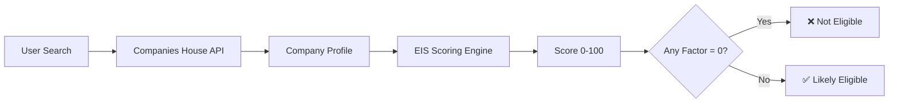
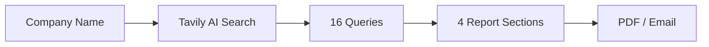
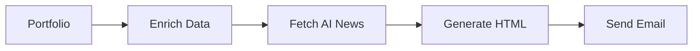
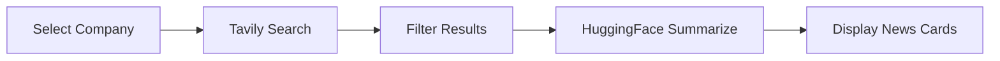
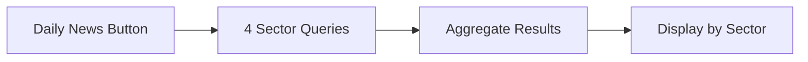
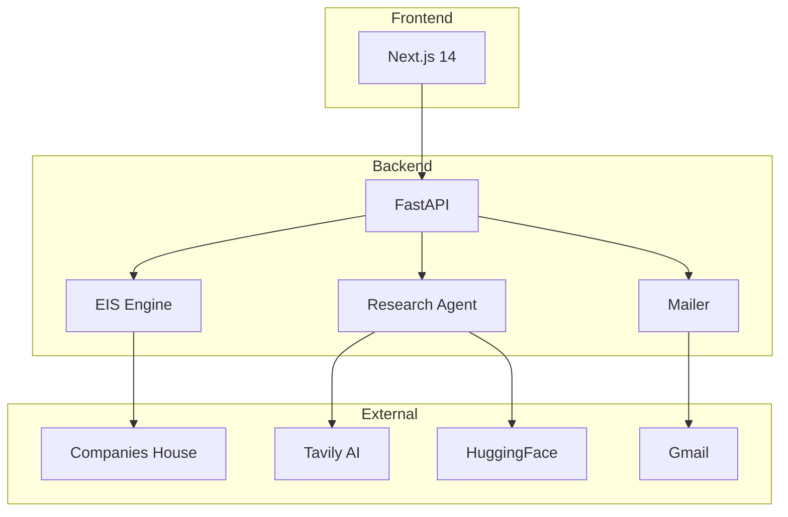

# EIS Investment Scanner — Architecture Report

*Sapphire Capital Partners | December 2024 | Version 2.2*

---

## Executive Summary

The EIS Investment Scanner screens UK companies for Enterprise Investment Scheme eligibility using Companies House data, AI-powered news analysis, and automated reporting.

---

## 1. EIS Page — Company Search & Scoring

**Purpose:** Search UK companies and calculate EIS eligibility scores (0-100)



**Data Flow:**
1. User enters company name
2. Backend searches Companies House
3. Full profile retrieved (officers, PSCs, filings, charges)
4. EIS heuristics calculate score based on 6 factors
5. If any factor scores 0 → "Likely Not Eligible"

**Technologies:** Next.js 14, FastAPI, Companies House API

---

## 2. Research Agent — Deep Company Analysis

**Purpose:** Generate comprehensive company research reports using AI



**Report Sections:**
| Section | Content |
|---------|---------|
| Company Overview | Funding, valuation, team, HQ |
| Industry Analysis | Market size, trends, competition |
| Financial Profile | Revenue, growth, funding rounds |
| Recent News | Latest announcements, press |

**Technologies:** Tavily API, WeasyPrint PDF, Gmail SMTP

---

## 3. Newsletter Subscription — Portfolio Reports

**Purpose:** Send automated EIS portfolio intelligence emails



**Email Sections:**
1. Portfolio Summary (stats)
2. Top Changes (top 3 companies)
3. AI Company Intelligence (Tavily news)
4. Watchlist (review required)
5. Full Portfolio Table
6. Next Scheduled Run

**Frequency Options:** Now, Weekly, Monthly, Yearly

**Technologies:** Tavily API, HuggingFace Mistral 7B, Gmail SMTP

---

## 4. AI Newsroom — Company-Specific News

**Purpose:** Fetch and summarize real-time news for a specific company



**Features:**
- Real-time news from Tavily
- AI summarization with Mistral 7B
- EIS relevance filtering
- Source links included

**Technologies:** Tavily API, HuggingFace API

---

## 5. AI Daily News — Sector Intelligence

**Purpose:** Aggregate daily investment news across UK sectors



**Sectors Covered:**
| Sector | Focus |
|--------|-------|
| Technology | Startups, AI, SaaS |
| Healthcare | Biotech, Medtech |
| Fintech | Payments, Banking |
| Clean Energy | Renewables, CleanTech |

**Technologies:** Tavily API

---

## System Architecture Overview



---

## Technology Stack

| Layer | Technology |
|-------|------------|
| **Frontend** | Next.js 14, TypeScript, Tailwind CSS |
| **Backend** | Python 3.11, FastAPI, Pandas |
| **AI/ML** | Tavily, HuggingFace Mistral 7B |
| **APIs** | Companies House, Gmail SMTP |
| **PDF** | WeasyPrint |

---

## Environment Variables

```
COMPANIES_HOUSE_API_KEY=xxxxxxxx
TAVILY_API_KEY=tvly-xxxxxxxx
HF_API_KEY=hf_xxxxxxxx
GMAIL_ADDRESS=your@gmail.com
GMAIL_APP_PASSWORD=xxxx-xxxx-xxxx-xxxx
```

---

## EIS Scoring Factors (0-100)

| Factor | Max Points | Criteria |
|--------|------------|----------|
| Company Age | 20 | Under 7 years old |
| Company Status | 15 | Active (not dissolved) |
| SIC Codes | 20 | Qualifying sectors |
| No Insolvency | 15 | Clean history |
| No Excluded Trades | 15 | Not in excluded list |
| R&D/Knowledge | 15 | Innovation focus |

**Eligibility Rule:** If ANY factor = 0 → "Likely Not Eligible"

---

*Report Generated: December 27, 2024*
