# EIS Investment Scanner — Architecture Report

## System Overview

The EIS Investment Scanner is a comprehensive platform for screening UK companies for Enterprise Investment Scheme (EIS) eligibility. This document details the architecture and data flow for each major component.

---

## 1. Complete EIS Page Architecture

### How It Works

The EIS page is a full-stack application connecting a Next.js frontend to a FastAPI backend, which integrates with multiple external APIs.

```mermaid
flowchart TB
    subgraph Frontend["🖥️ Next.js Frontend"]
        SearchBar[Search Input]
        PortfolioTab[Portfolio Tab]
        SearchTab[Search Results Tab]
        CompanyDetails[Company Details Panel]
        StatsGrid[Stats Grid: Directors, PSCs, Share Allotments, Age, Revenue]
        EligibilityGates[Eligibility Gates Display]
        ScoreBreakdown[Score Breakdown 0-100]
        ActionButtons[Add to Portfolio / Subscribe / Export]
    end

    subgraph Backend["⚙️ FastAPI Backend"]
        SearchAPI["/api/eis/search/{query}"]
        ProfileAPI["/api/eis/company/{id}/full-profile"]
        NewsAPI["/api/eis/company/{id}/news"]
        EISEngine[EIS Heuristics Engine]
        TavilyFinancial[Tavily Financial Research]
    end

    subgraph External["🌐 External APIs"]
        CompaniesHouse["Companies House API"]
        TavilyAPI["Tavily API"]
        HuggingFace["HuggingFace API"]
    end

    subgraph Storage["💾 Local Storage"]
        LocalPortfolio[Browser LocalStorage]
        ScanHistory[scan_history.json]
    end

    SearchBar --> SearchAPI
    SearchAPI --> CompaniesHouse
    CompaniesHouse --> SearchTab
    
    SearchTab -->|Select Company| ProfileAPI
    ProfileAPI --> CompaniesHouse
    ProfileAPI --> EISEngine
    EISEngine --> ScoreBreakdown
    
    ProfileAPI -->|No Accounts Data| TavilyFinancial
    TavilyFinancial --> TavilyAPI
    TavilyAPI --> StatsGrid
    
    CompanyDetails --> EligibilityGates
    ActionButtons -->|Save| LocalPortfolio
    PortfolioTab --> LocalPortfolio
```

### Plugins & Technologies

| Component | Technology | Purpose |
|-----------|------------|---------|
| **Frontend Framework** | Next.js 14 + TypeScript | Server-side rendering, routing |
| **Styling** | Tailwind CSS | Utility-first styling |
| **Animations** | Framer Motion | Smooth transitions |
| **Icons** | Lucide React | Modern icon library |
| **Charts** | Recharts | Score gauge visualization |
| **State** | React useState + LocalStorage | Portfolio persistence |

### Key Features Flow

---

## 2. Company Research Agent Architecture

### How It Works

The Research Agent performs deep company research using Tavily AI search across 4 categories with 16 parallel queries.

### Research Agent Data Flow

---

## 3. Subscribe (Newsletter) Architecture

### How It Works

The Subscribe feature generates professional HTML email newsletters with portfolio intelligence, AI company news, and sector insights.

### Newsletter Content Generation

---

## 4. AI Newsroom Architecture

### How It Works

The AI Newsroom fetches real-time news for a selected company using Tavily and summarizes it with HuggingFace.

### AI Newsroom Data Flow

---

## 5. AI Daily News Architecture

### How It Works

The AI Daily News feature provides sector-wide investment news across Technology, Healthcare, Fintech, and Clean Energy sectors.

### Daily News Sequence

---

## Technology Stack Summary

---

## Environment Variables Required

| Variable | Service | Purpose |
|----------|---------|---------|
| `COMPANIES_HOUSE_API_KEY` | Companies House | UK company data |
| `TAVILY_API_KEY` | Tavily | AI news search |
| `HF_API_KEY` | HuggingFace | LLM summarization |
| `GMAIL_ADDRESS` | Gmail | Newsletter sending |
| `GMAIL_APP_PASSWORD` | Gmail | SMTP authentication |

---

*Report Generated: December 26, 2024*  
*Platform Version: 2.2.0*
