# EIS Investment Scanner
## Architecture Documentation

---

## System Overview

```mermaid
flowchart LR
    A[👤 User] --> B[🖥️ Frontend]
    B --> C[⚙️ Backend]
    C --> D[🌐 APIs]
    
    style A fill:#6366f1,color:#fff
    style B fill:#3b82f6,color:#fff
    style C fill:#22c55e,color:#fff
    style D fill:#f59e0b,color:#fff
```



| Layer | Technology |
|-------|------------|
| Frontend | Next.js 14, TypeScript, Tailwind CSS |
| Backend | FastAPI, Python 3.11 |
| APIs | Companies House, Tavily, HuggingFace, Gmail |

---

## 1. EIS Page — Search & Score

**Purpose:** Search UK companies and calculate EIS eligibility score (0-100)

```mermaid
flowchart TD
    A[🔍 Search Company] --> B[Companies House API]
    B --> C[Get Full Profile]
    C --> D[Calculate EIS Score]
    D --> E{Score < 50 or<br/>Any Factor = 0?}
    E -->|Yes| F[❌ Not Eligible]
    E -->|No| G[✅ Likely Eligible]
    
    style A fill:#3b82f6,color:#fff
    style B fill:#f59e0b,color:#fff
    style C fill:#22c55e,color:#fff
    style D fill:#6366f1,color:#fff
    style F fill:#ef4444,color:#fff
    style G fill:#22c55e,color:#fff
```



**Scoring Factors:**

| Factor | Points | Criteria |
|--------|--------|----------|
| Company Age | 20 | Under 7 years |
| Status | 15 | Active |
| SIC Code | 20 | Eligible sector |
| Insolvency | 15 | No history |
| Excluded Trades | 15 | Not banned |
| R&D | 15 | Knowledge intensive |

---

## 2. Research Agent

**Purpose:** Deep company research with 16 AI queries, PDF & email export

```mermaid
flowchart TD
    A[📝 Enter Company Name] --> B[16 Tavily Queries]
    B --> C[Company Info]
    B --> D[Industry Info]
    B --> E[Financial Info]
    B --> F[News Info]
    C & D & E & F --> G[📊 Research Report]
    G --> H[📋 Copy]
    G --> I[📄 PDF]
    G --> J[📧 Email]
    
    style A fill:#3b82f6,color:#fff
    style B fill:#f59e0b,color:#fff
    style G fill:#22c55e,color:#fff
    style H fill:#6366f1,color:#fff
    style I fill:#6366f1,color:#fff
    style J fill:#6366f1,color:#fff
```



---

## 3. Newsletter (Subscribe)

**Purpose:** Send professional email with portfolio updates and AI news

```mermaid
flowchart TD
    A[📧 Subscribe] --> B[Load Portfolio]
    B --> C[Fetch Company News]
    C --> D[AI Summarize]
    D --> E[Generate HTML Email]
    E --> F[Gmail SMTP]
    F --> G[📬 Inbox]
    
    style A fill:#3b82f6,color:#fff
    style C fill:#f59e0b,color:#fff
    style D fill:#ec4899,color:#fff
    style E fill:#22c55e,color:#fff
    style G fill:#6366f1,color:#fff
```



**Email Sections:**
1. Portfolio Summary
2. Top Changes (Score + Revenue + Status)
3. AI Company Intelligence
4. Watchlist
5. Full Portfolio Table

---

## 4. AI Newsroom

**Purpose:** Real-time company news with AI summary

```mermaid
flowchart LR
    A[🏢 Company] --> B[Tavily Search]
    B --> C[HuggingFace AI]
    C --> D[📰 News Summary]
    
    style A fill:#3b82f6,color:#fff
    style B fill:#f59e0b,color:#fff
    style C fill:#ec4899,color:#fff
    style D fill:#22c55e,color:#fff
```



---

## 5. AI Daily News

**Purpose:** Sector-wide UK startup investment news

```mermaid
flowchart TD
    A[📰 Daily News] --> B[Tavily API]
    B --> C[💻 Technology]
    B --> D[🏥 Healthcare]
    B --> E[💳 Fintech]
    B --> F[🌱 Clean Energy]
    
    style A fill:#3b82f6,color:#fff
    style B fill:#f59e0b,color:#fff
    style C fill:#22c55e,color:#fff
    style D fill:#22c55e,color:#fff
    style E fill:#22c55e,color:#fff
    style F fill:#22c55e,color:#fff
```



---

## API Endpoints

| Endpoint | Purpose |
|----------|---------|
| `GET /api/eis/search/{query}` | Search companies |
| `GET /api/eis/company/{id}/full-profile` | Get profile + EIS score |
| `GET /api/eis/company/{id}/news` | AI Newsroom |
| `GET /api/eis/daily-news` | Daily sector news |
| `POST /api/eis/automation/send-email` | Send newsletter |
| `POST /api/research/company` | Research agent |
| `POST /api/research/pdf` | Generate PDF |

---

## Environment Setup

```env
COMPANIES_HOUSE_API_KEY=your_key
TAVILY_API_KEY=tvly-xxxxx
HF_API_KEY=hf_xxxxx
GMAIL_ADDRESS=email@gmail.com
GMAIL_APP_PASSWORD=app_password
```

---

*Version 2.2.0 | December 2024*
