# EIS Investment Scanner - Architecture Documentation

## Complete System Architecture with Mermaid Diagrams

---

## 1. EIS Investment Scanner - Complete Page Workflow

This diagram shows how the entire EIS Investment Scanner page works, from search to portfolio management.

```mermaid
flowchart TB
    subgraph Frontend["🖥️ Frontend (Next.js 14)"]
        UI[EIS Page<br/>page.tsx]
        Search[Search Input]
        Results[Search Results Grid]
        Details[Company Details Panel]
        Portfolio[Portfolio Tab]
        Stats[Stats Grid<br/>Directors/PSCs/Age/Revenue]
        Gates[Eligibility Gates Display]
        Breakdown[Score Breakdown]
    end

    subgraph Backend["⚙️ Backend (FastAPI)"]
        SearchAPI["/api/eis/search"]
        ProfileAPI["/api/eis/company/{id}/full-profile"]
        EISEngine[EIS Heuristics Engine<br/>eis_heuristics.py]
        TavilyFinance[Tavily Financial Research]
    end

    subgraph External["🌐 External APIs"]
        CH[Companies House API]
        Tavily[Tavily API]
    end

    subgraph Components["🧩 UI Components"]
        ScoreGauge[Score Gauge<br/>/100 scale]
        Badge[Eligibility Badge<br/>Green/Red]
        StatsCard[Stats Cards x5]
    end

    %% User Flow
    User([👤 User]) --> Search
    Search -->|"Enter company name"| SearchAPI
    SearchAPI -->|"Search query"| CH
    CH -->|"Company list"| Results
    Results -->|"Click company"| ProfileAPI
    
    %% Profile Loading
    ProfileAPI --> CH
    CH -->|"Full profile data"| EISEngine
    EISEngine -->|"Calculate score"| ProfileAPI
    ProfileAPI -->|"Check accounts"| TavilyFinance
    TavilyFinance -->|"If no data"| Tavily
    Tavily -->|"Revenue/Funding"| ProfileAPI
    
    %% Display
    ProfileAPI --> Details
    Details --> Stats
    Details --> Gates
    Details --> Breakdown
    Details --> ScoreGauge
    Details --> Badge
    
    %% Eligibility Logic
    EISEngine -->|"factors[]"| Badge
    Badge -->|"Any score=0?"| BadgeLogic{Zero Factor?}
    BadgeLogic -->|"Yes"| RedBadge[🔴 Likely Not Eligible]
    BadgeLogic -->|"No"| GreenBadge[🟢 Likely Eligible]
    
    %% Portfolio
    Details -->|"Add to Portfolio"| Portfolio
    Portfolio -->|"LocalStorage"| Browser[(Browser Storage)]

    style Frontend fill:#1e293b,stroke:#4f46e5,color:#fff
    style Backend fill:#1e293b,stroke:#10b981,color:#fff
    style External fill:#1e293b,stroke:#f59e0b,color:#fff
```



### Key Technologies & Plugins

| Component | Technology | Purpose |
|-----------|------------|---------|
| **Frontend Framework** | Next.js 14 | React SSR, App Router |
| **UI Library** | Tailwind CSS | Responsive styling |
| **Animations** | Framer Motion | Smooth transitions |
| **Icons** | Lucide React | Icon library |
| **Charts** | Recharts | Data visualization |
| **State** | React useState | Local state management |
| **Backend** | FastAPI | Python REST API |
| **EIS Engine** | Custom Python | Heuristic scoring |

---

## 2. Company Research Agent Workflow

This diagram shows how the AI-powered Research Agent generates company reports using Tavily.


### Research Query Categories

| Category | Queries | Example |
|----------|---------|---------|
| **Company** | Funding, Valuation, Team, HQ | "Spotify funding rounds 2024" |
| **Industry** | Market size, Trends, Competition | "Music streaming market size" |
| **Financial** | Revenue, Growth, Profitability | "Spotify revenue 2024" |
| **News** | Announcements, Press, Updates | "Spotify latest news" |

---

## 3. Newsletter Subscribe Workflow

This diagram shows the newsletter subscription and email sending process.


### Newsletter Email Sections

| Section | Content | Data Source |
|---------|---------|-------------|
| **Portfolio Summary** | Stats: reviewed, eligible, review, ineligible | Calculated from portfolio |
| **Top Changes** | Top 3 companies with recommendations | Portfolio + EIS scoring |
| **AI Company Intelligence** | Tavily news per company | Tavily API |
| **Watchlist** | Companies needing review | Risk flags analysis |
| **Full Portfolio** | Compact table with all companies | Portfolio data |
| **Next Scheduled Run** | Based on frequency selection | User selection |

---

## 4. AI Newsroom Workflow

This diagram shows how the AI Newsroom generates news summaries for companies.


### AI Newsroom Features

| Feature | Description |
|---------|-------------|
| **Multi-Query Search** | 3 different query types per company |
| **AI Summarization** | Mistral 7B via HuggingFace |
| **Relevance Scoring** | Filters irrelevant results |
| **Source Attribution** | Links to original articles |
| **EIS Context** | Includes score and status |

---

## 5. AI Daily News Workflow

This diagram shows the sector-wide daily news aggregation system.

```mermaid
flowchart TB
    subgraph Frontend["🖥️ EIS Header"]
        DailyBtn[AI Daily News Button]
        DailyModal[Daily News Modal]
        SectorTabs[Sector Tabs<br/>Tech/Healthcare/Fintech/CleanEnergy]
        NewsFeed[News Feed Cards]
    end

    subgraph Backend["⚙️ Backend"]
        DailyAPI["/api/eis/daily-news"]
        SectorQueries[Sector Query Builder]
        Aggregator[News Aggregator]
    end

    subgraph TavilySearch["🔍 Tavily Sector Search"]
        TechQ["UK technology startup funding 2024"]
        HealthQ["UK healthcare biotech funding 2024"]
        FintechQ["UK fintech payments investment 2024"]
        CleanQ["UK cleantech green energy funding 2024"]
    end

    subgraph Processing["🔄 Processing"]
        Filter[Filter & Dedupe]
        Format[Format Results]
        Cache[Cache Results<br/>15 min TTL]
    end

    subgraph Output["📰 Daily News Output"]
        TechNews[Technology News]
        HealthNews[Healthcare News]
        FintechNews[Fintech News]
        CleanNews[Clean Energy News]
    end

    %% Flow
    User([👤 User]) --> DailyBtn
    DailyBtn --> DailyModal
    DailyModal --> SectorTabs
    
    SectorTabs -->|"Load sector"| DailyAPI
    DailyAPI --> SectorQueries
    
    SectorQueries --> TechQ
    SectorQueries --> HealthQ
    SectorQueries --> FintechQ
    SectorQueries --> CleanQ
    
    TechQ --> TavilyAPI[(Tavily API)]
    HealthQ --> TavilyAPI
    FintechQ --> TavilyAPI
    CleanQ --> TavilyAPI
    
    TavilyAPI --> Aggregator
    Aggregator --> Filter
    Filter --> Format
    Format --> Cache
    
    Cache --> TechNews
    Cache --> HealthNews
    Cache --> FintechNews
    Cache --> CleanNews
    
    TechNews --> NewsFeed
    HealthNews --> NewsFeed
    FintechNews --> NewsFeed
    CleanNews --> NewsFeed

    style Frontend fill:#1e293b,stroke:#4f46e5,color:#fff
    style Backend fill:#1e293b,stroke:#10b981,color:#fff
    style TavilySearch fill:#1e293b,stroke:#f59e0b,color:#fff
    style Processing fill:#1e293b,stroke:#8b5cf6,color:#fff
```



### Sector News Categories

| Sector | Focus Areas | UK Keywords |
|--------|-------------|-------------|
| **Technology** | AI, SaaS, Deep Tech | "UK technology startup funding" |
| **Healthcare** | Biotech, Medtech, Digital Health | "UK healthcare biotech investment" |
| **Fintech** | Payments, Banking, InsurTech | "UK fintech digital banking" |
| **Clean Energy** | Renewables, Battery, CleanTech | "UK cleantech green energy" |

---

## Complete System Integration


---

## Environment Variables Required

```env
# Companies House API
COMPANIES_HOUSE_API_KEY=xxxxxxxx

# Tavily AI Search
TAVILY_API_KEY=tvly-xxxxxxxx

# HuggingFace AI
HF_API_KEY=hf_xxxxxxxx

# Gmail SMTP
GMAIL_ADDRESS=your@gmail.com
GMAIL_APP_PASSWORD=xxxx-xxxx-xxxx-xxxx
```

---

*Report Generated: December 26, 2024*
*Platform: Sapphire Intelligence EIS Scanner v2.2.0*
