# EIS Investment Scanner - Architecture Report

## Complete System Architecture & Component Documentation

**Version:** 2.2.0  
**Last Updated:** December 27, 2024  
**Author:** Sapphire Intelligence Team

---

## Table of Contents

1. [Complete EIS Page Architecture](#1-complete-eis-page-architecture)
2. [Company Research Agent](#2-company-research-agent)
3. [Newsletter Subscribe System](#3-newsletter-subscribe-system)
4. [AI Newsroom](#4-ai-newsroom)
5. [AI Daily News](#5-ai-daily-news)

---

## 1. Complete EIS Page Architecture

### Overview
The EIS Investment Scanner is a full-stack application that screens UK companies for Enterprise Investment Scheme eligibility using Companies House data and AI-powered analysis.

### System Block Diagram

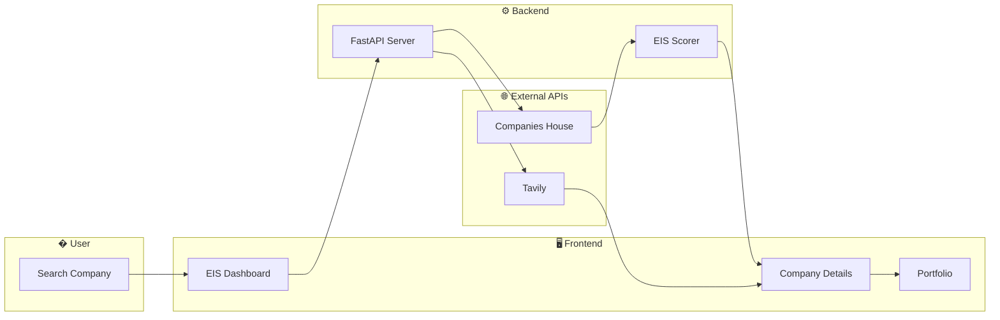

### Data Flow (Step by Step)

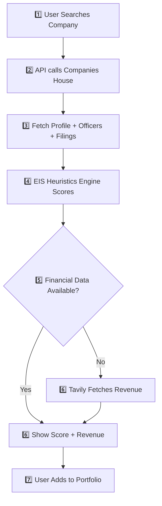

### Key Components

| Component | Technology | Purpose |
|-----------|------------|---------|
| **EIS Dashboard** | React + TypeScript | Main user interface |
| **Company Search** | Next.js API Routes | Search Companies House |
| **EIS Heuristics Engine** | Python | Calculate eligibility score |
| **Score Calculator** | Python | 0-100 scoring with factors |
| **Tavily Financial** | Tavily API | Fallback revenue lookup |

### Plugins & Presets Used

| Plugin/Library | Version | Purpose |
|----------------|---------|---------|
| **Next.js** | 14.x | React framework with App Router |
| **Tailwind CSS** | 3.x | Utility-first styling |
| **Framer Motion** | 10.x | Animations & transitions |
| **Lucide React** | Latest | Icon library |
| **Recharts** | 2.x | Data visualization |
| **FastAPI** | 0.100+ | Python REST API |
| **Pandas** | 2.x | Data processing |
| **httpx** | 0.24+ | Async HTTP client |

### EIS Scoring Factors

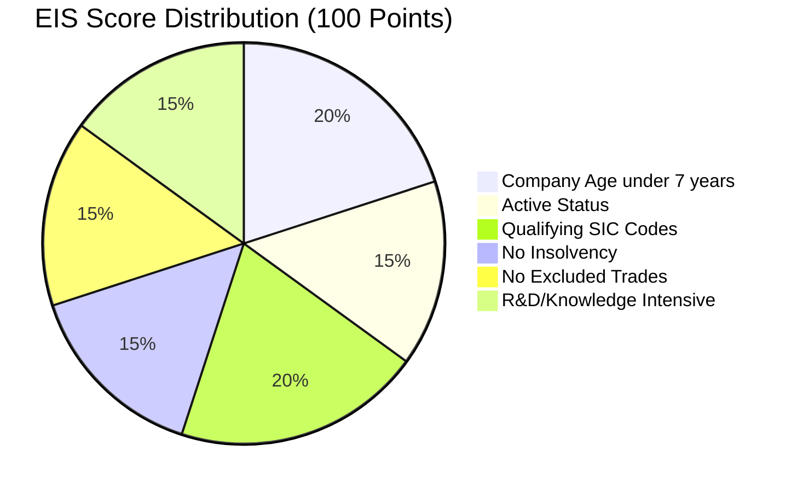

### Eligibility Logic Flow

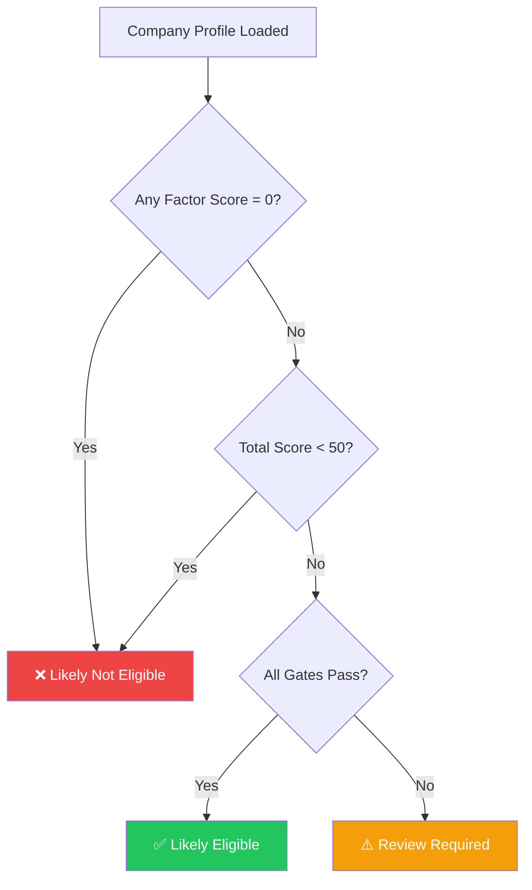

---

## 2. Company Research Agent

### Overview
The Research Agent performs deep company research using Tavily AI search, generating structured reports with PDF export and email delivery.

### Architecture Diagram

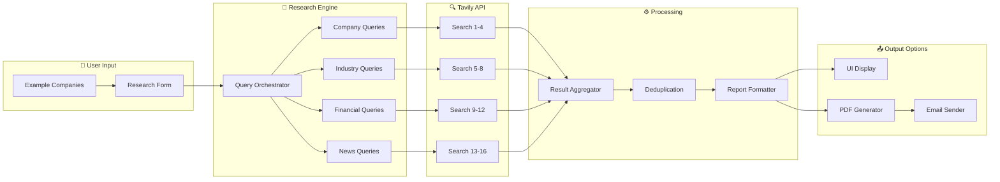

### Query Categories (16 Total Queries)

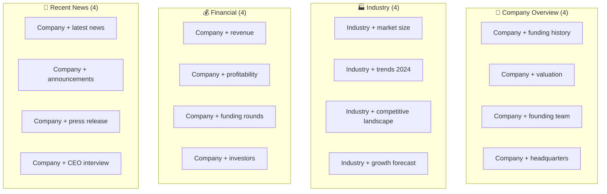

### API Endpoints

| Endpoint | Method | Purpose |
|----------|--------|---------|
| `/api/research/company` | POST | Trigger 16-query research |
| `/api/research/pdf` | POST | Generate WeasyPrint PDF |
| `/api/research/email` | POST | Send PDF via Gmail SMTP |

---

## 3. Newsletter Subscribe System

### Overview
The Subscribe system sends professional HTML emails with portfolio intelligence, AI company news, and eligibility analysis.

### Architecture Diagram

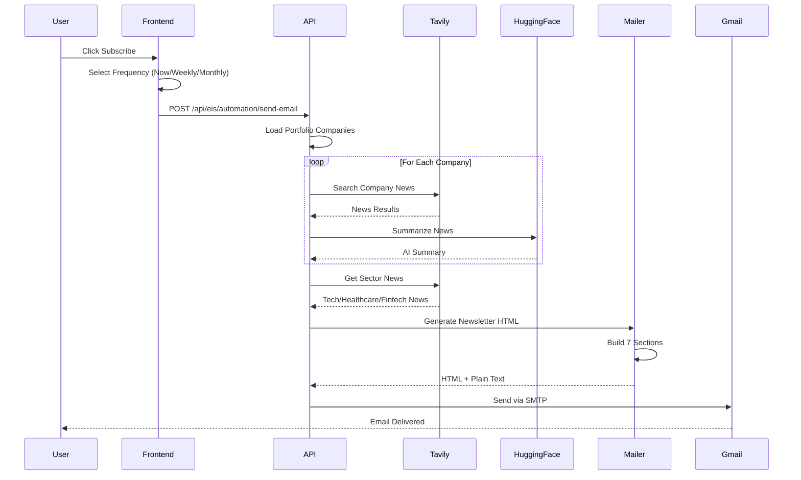

### Newsletter Sections

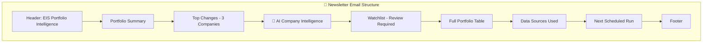

### Frequency Options

| Frequency | Next Run Calculation |
|-----------|---------------------|
| **Weekly** | Next Monday 08:00 |
| **Monthly** | 1st of Next Month 08:00 |
| **Yearly** | January 1st 08:00 |
| **Now** | Immediate (Manual) |

### Email Content Per Company

```
┌─────────────────────────────────────────────────────────────┐
│ COMPANY NAME (00000000) — Likely Not Eligible (Score: 78)  │
│ 💰 Revenue: £45.6M | 🏢 Sector: Technology                  │
│ • Company Age score is 0/20                                 │
│ → Recommended: Remove from EIS candidate list               │
└─────────────────────────────────────────────────────────────┘
```

---

## 4. AI Newsroom

### Overview
The AI Newsroom provides real-time company news using Tavily search with HuggingFace AI summarization.

### Architecture Diagram

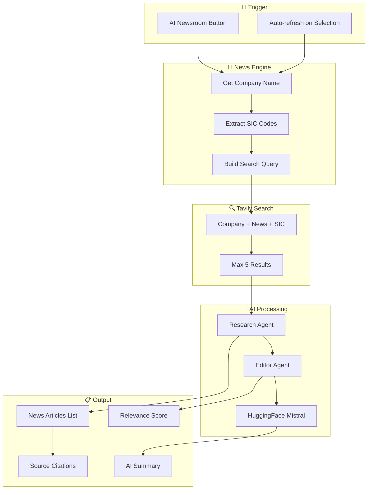

### News Card Display

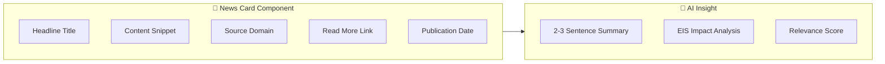

### API Flow

| Step | Endpoint | Data |
|------|----------|------|
| 1 | `/api/eis/company/id/news` | Company Number |
| 2 | Internal | Tavily Search Query |
| 3 | Internal | HuggingFace Summarization |
| 4 | Response | News + AI Summary |

---

## 5. AI Daily News

### Overview
The AI Daily News feature provides sector-wide EIS market intelligence updated daily.

### Architecture Diagram

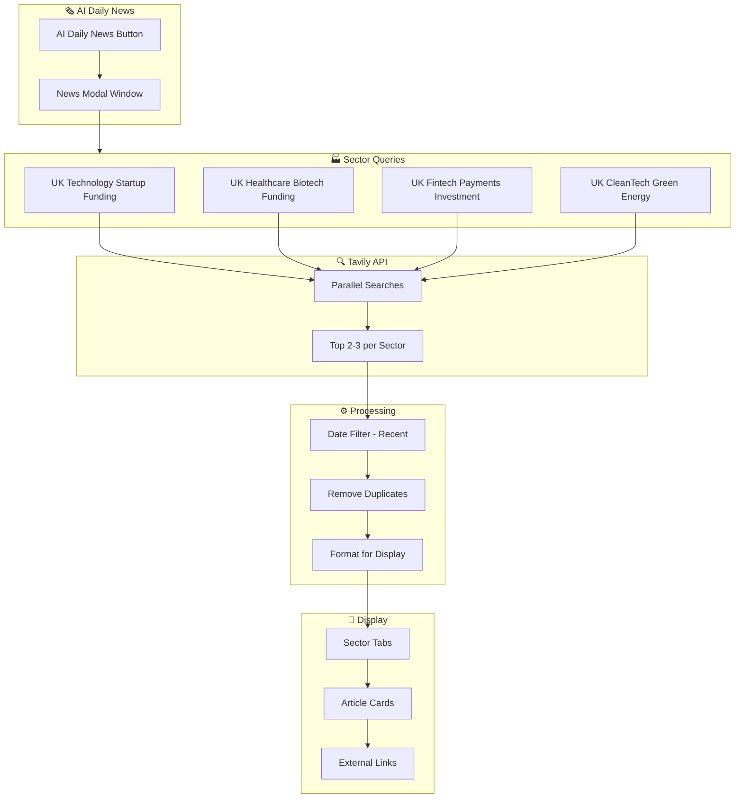

### Sector Categories

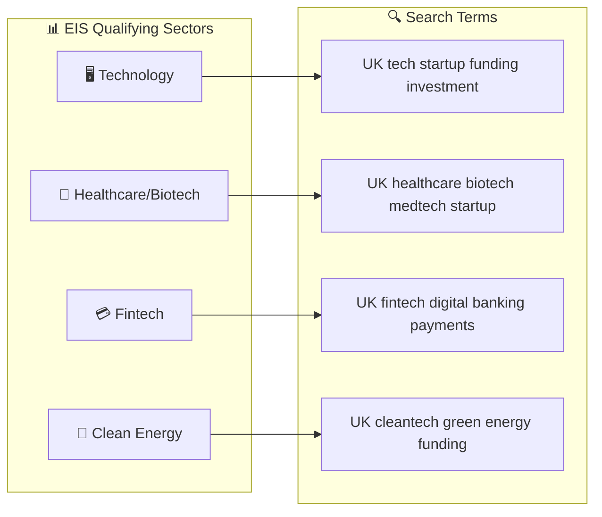

### News Display Format

```
┌─────────────────────────────────────────────────────────────┐
│ 📅 December 27, 2024                                        │
├─────────────────────────────────────────────────────────────┤
│ 🖥️ TECHNOLOGY                                               │
│ ─────────────────────────────────────────────────────────── │
│ UK AI Startup Raises £50M Series B                          │
│ The London-based AI company has secured funding...          │
│ 📰 TechCrunch | Read More →                                 │
├─────────────────────────────────────────────────────────────┤
│ 🏥 HEALTHCARE                                               │
│ ─────────────────────────────────────────────────────────── │
│ Biotech Firm Gets NHS Innovation Contract                   │
│ A Manchester biotech startup has won...                     │
│ 📰 The Guardian | Read More →                               │
└─────────────────────────────────────────────────────────────┘
```

---

## Technology Stack Summary

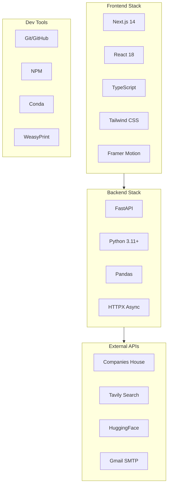

---

## Environment Configuration

```env
# Companies House API
COMPANIES_HOUSE_API_KEY=xxxxxxxxxx

# Tavily AI Search
TAVILY_API_KEY=tvly-xxxxxxxxxx

# HuggingFace LLM
HF_API_KEY=hf_xxxxxxxxxx

# Gmail SMTP
GMAIL_ADDRESS=your@gmail.com
GMAIL_APP_PASSWORD=xxxx-xxxx-xxxx-xxxx
```

---

## Repository

**GitHub:** [nagasriramnani/Currency-Intelligence-Platform-V2](https://github.com/nagasriramnani/Currency-Intelligence-Platform-V2)

---

*Report Generated: December 27, 2024*  
*Version: 2.2.0*
