# EIS Investment Scanner - Architecture Report

## Executive Summary

The **EIS Investment Scanner** is a comprehensive AI-powered platform for screening UK companies for Enterprise Investment Scheme (EIS) eligibility. This document provides detailed architecture diagrams and explanations for each major component.

---

## Table of Contents

1. [EIS Page - Complete System Architecture](#1-eis-page---complete-system-architecture)
2. [Company Research Agent](#2-company-research-agent)
3. [Newsletter Subscription Flow](#3-newsletter-subscription-flow)
4. [AI Newsroom](#4-ai-newsroom)
5. [AI Daily News](#5-ai-daily-news)

---

## 1. EIS Page - Complete System Architecture

### Overview
The EIS Page is the main dashboard for searching, analyzing, and managing UK companies for EIS eligibility assessment.

### Flow Diagram



```mermaid
flowchart TB
    subgraph User["👤 User Interface"]
        SearchBar[("🔍 Search Bar")]
        PortfolioTab["📁 Portfolio Tab"]
        SearchResults["📋 Search Results"]
        CompanyDetails["📊 Company Details Panel"]
    end

    subgraph Frontend["⚛️ Next.js Frontend"]
        EISPage["EIS Page Component"]
        SearchHandler["Search Handler"]
        ProfileLoader["Profile Loader"]
        PortfolioManager["Portfolio Manager"]
        ScoreGauge["Score Gauge Component"]
        StatsCards["Stats Cards Component"]
    end

    subgraph Backend["🐍 FastAPI Backend"]
        SearchAPI["/api/eis/search"]
        FullProfileAPI["/api/eis/company/{id}/full-profile"]
        EISHeuristics["EIS Heuristics Engine"]
        TavilyFinancial["Tavily Financial Research"]
    end

    subgraph External["🌐 External APIs"]
        CompaniesHouse["UK Companies House API"]
        TavilyAPI["Tavily Search API"]
    end

    subgraph DataFlow["📊 Data Processing"]
        CompanyProfile["Company Profile Data"]
        OfficersData["Officers & Directors"]
        PSCData["Persons of Significant Control"]
        FilingsData["Filing History"]
        ChargesData["Charges & Mortgages"]
    end

    %% User Flow
    SearchBar -->|"Enter company name"| SearchHandler
    SearchHandler -->|"GET request"| SearchAPI
    SearchAPI -->|"Search query"| CompaniesHouse
    CompaniesHouse -->|"Search results"| SearchAPI
    SearchAPI -->|"JSON response"| SearchResults

    %% Company Selection
    SearchResults -->|"Click company"| ProfileLoader
    ProfileLoader -->|"GET request"| FullProfileAPI

    %% Full Profile Fetching
    FullProfileAPI -->|"Parallel requests"| CompaniesHouse
    CompaniesHouse --> CompanyProfile
    CompaniesHouse --> OfficersData
    CompaniesHouse --> PSCData
    CompaniesHouse --> FilingsData
    CompaniesHouse --> ChargesData

    %% EIS Assessment
    CompanyProfile --> EISHeuristics
    OfficersData --> EISHeuristics
    FilingsData --> EISHeuristics
    EISHeuristics -->|"Score calculation"| FullProfileAPI

    %% Tavily Financial Fallback
    FullProfileAPI -->|"If no accounts data"| TavilyFinancial
    TavilyFinancial -->|"Search: company + revenue"| TavilyAPI
    TavilyAPI -->|"Financial data"| TavilyFinancial
    TavilyFinancial -->|"Parsed revenue"| FullProfileAPI

    %% Display
    FullProfileAPI -->|"Complete profile + EIS score"| CompanyDetails
    CompanyDetails --> ScoreGauge
    CompanyDetails --> StatsCards

    %% Portfolio
    CompanyDetails -->|"Add to Portfolio"| PortfolioManager
    PortfolioManager --> PortfolioTab

    style User fill:#e1f5fe
    style Frontend fill:#fff3e0
    style Backend fill:#e8f5e9
    style External fill:#fce4ec
    style DataFlow fill:#f3e5f5
```

### Key Components

| Component | Technology | Purpose |
|-----------|------------|---------|
| **EIS Page** | Next.js 14 + TypeScript | Main dashboard UI |
| **Search API** | FastAPI | Company name search |
| **Full Profile API** | FastAPI | Comprehensive company data |
| **EIS Heuristics** | Python | 0-100 eligibility scoring |
| **Tavily Financial** | Tavily API | Revenue lookup fallback |
| **Companies House** | External API | Official UK company data |

### EIS Scoring Breakdown

```mermaid
flowchart LR
    subgraph Scoring["EIS Score Calculation (0-100)"]
        Age["Company Age<br/>≤7 years: +20"]
        Status["Active Status<br/>+15"]
        SIC["Qualifying SIC<br/>+20"]
        Insolvency["No Insolvency<br/>+15"]
        Trades["No Excluded Trades<br/>+15"]
        RnD["R&D Intensive<br/>+15"]
    end

    subgraph Result["Final Result"]
        Score["Total Score"]
        Eligible["✅ Likely Eligible<br/>(score ≥ 50, no 0 factors)"]
        NotEligible["❌ Likely Not Eligible<br/>(any factor = 0 or score < 50)"]
    end

    Age --> Score
    Status --> Score
    SIC --> Score
    Insolvency --> Score
    Trades --> Score
    RnD --> Score

    Score -->|"≥50 & no zeros"| Eligible
    Score -->|"<50 OR any factor=0"| NotEligible

    style Eligible fill:#4caf50,color:#fff
    style NotEligible fill:#f44336,color:#fff
```



---

## 2. Company Research Agent

### Overview
The Research Agent performs deep-dive company research using Tavily AI, generating structured reports with PDF export and email delivery.

### Flow Diagram


### Research Query Categories

| Category | Queries | Purpose |
|----------|---------|---------|
| **Company Overview** | Funding, valuation, team, headquarters | Core company information |
| **Industry Overview** | Market size, trends, competitors | Sector context |
| **Financial Overview** | Revenue, growth, profitability | Financial health |
| **Recent News** | Press releases, announcements | Latest updates |

### API Endpoints


---

## 3. Newsletter Subscription Flow

### Overview
Users can subscribe to receive AI-powered newsletter emails with portfolio updates, EIS assessments, and AI-generated company intelligence.

### Flow Diagram


### Frequency Options

| Frequency | Next Scheduled Run |
|-----------|-------------------|
| **Weekly** | Every Monday at 08:00 |
| **Monthly** | 1st of each month at 08:00 |
| **Yearly** | January 1st at 08:00 |
| **Now** | Immediate (on-demand) |

### Newsletter Email Structure

```
┌────────────────────────────────────────────────────┐
│  EIS Portfolio Intelligence — Weekly Snapshot      │
│  Week of December 27, 2024                         │
├────────────────────────────────────────────────────┤
│  PORTFOLIO SUMMARY                                 │
│  • Companies reviewed: 7                           │
│  • Likely eligible: 5                              │
│  • Review required: 1                              │
│  • Likely ineligible: 1                            │
├────────────────────────────────────────────────────┤
│  TOP CHANGES (This Period)                         │
│  1) Company A — Likely Eligible (Score: 85/100)    │
│     💰 Revenue: £2.3M | 🏢 Sector: Technology      │
│     → Recommended: HMRC Advance Assurance check    │
├────────────────────────────────────────────────────┤
│  🤖 AI COMPANY INTELLIGENCE                        │
│  ┌─────────────────────────────────────────────┐   │
│  │ Company B (12345678)              78/100    │   │
│  │ 💰 Revenue: £1.5M | 📊 Status: Eligible     │   │
│  │ Recent funding round announced...           │   │
│  │ 📰 Sources: TechCrunch                      │   │
│  └─────────────────────────────────────────────┘   │
├────────────────────────────────────────────────────┤
│  WATCHLIST (Review Required)                       │
│  • Sector/SIC mismatch                             │
│  • Age outside standard EIS window                 │
├────────────────────────────────────────────────────┤
│  FULL PORTFOLIO                                    │
│  Company  | Score | Status  | Sector              │
│  ─────────┼───────┼─────────┼────────             │
│  Comp A   | 85    | Eligible| Tech                │
│  Comp B   | 78    | Eligible| Healthcare          │
├────────────────────────────────────────────────────┤
│  DATA SOURCES: Companies House, Tavily, HuggingFace│
│  Next Scheduled Run: Monday, Dec 30, 2024 at 08:00 │
└────────────────────────────────────────────────────┘
```

---

## 4. AI Newsroom

### Overview
The AI Newsroom provides real-time, AI-curated news for individual companies using Tavily search and HuggingFace summarization.

### Flow Diagram


### News Processing Pipeline


---

## 5. AI Daily News

### Overview
The AI Daily News feature provides sector-wide market intelligence across UK startup sectors (Technology, Healthcare, Fintech, Clean Energy).

### Flow Diagram


### Daily News Data Structure

```json
{
  "sectors": [
    {
      "name": "Technology",
      "news": [
        {
          "title": "UK Tech Startup Raises £10M Series A",
          "content": "Summary of the article...",
          "source": "techcrunch.com",
          "url": "https://..."
        }
      ]
    },
    {
      "name": "Healthcare",
      "news": [...]
    },
    {
      "name": "Fintech",
      "news": [...]
    },
    {
      "name": "Clean Energy",
      "news": [...]
    }
  ],
  "generated_at": "2024-12-27T19:00:00Z"
}
```

### Sector Query Templates

| Sector | Search Query |
|--------|-------------|
| Technology | `UK technology startup funding investment Series A 2024 2025` |
| Healthcare | `UK healthcare biotech medtech startup funding 2024 2025` |
| Fintech | `UK fintech digital banking payments startup investment 2024 2025` |
| Clean Energy | `UK cleantech green energy clean technology funding 2024 2025` |

---

## Technology Stack Summary


---

## Environment Variables Required

```env
# Core APIs
COMPANIES_HOUSE_API_KEY=your_key
TAVILY_API_KEY=tvly-xxxxxxxxxx
HF_API_KEY=hf_xxxxxxxxxx

# Email
GMAIL_ADDRESS=your@gmail.com
GMAIL_APP_PASSWORD=app_password

# Optional
SLACK_WEBHOOK_URL=https://hooks.slack.com/...
```

---

*Report Generated: December 27, 2024*  
*Version: 2.2.0*
