# EIS Investment Scanner - Architecture Report

## Complete System Architecture & Component Documentation

**Version:** 2.4.0  
**Last Updated:** December 29, 2025 
**Author:** Sapphire Intelligence Team

---

## Table of Contents

1. [Complete EIS Page Architecture](#1-complete-eis-page-architecture)
2. [Company Research Agent](#2-company-research-agent)
3. [Newsletter Subscribe System](#3-newsletter-subscribe-system)
4. [AI Newsroom](#4-ai-newsroom)
5. [AI Daily News](#5-ai-daily-news)
6. [Portfolio Persistence System](#6-portfolio-persistence-system)
7. [EIS Conversational Advisor (Ollama)](#7-eis-conversational-advisor-ollama)

---

## 1. Complete EIS Page Architecture

### Overview
The EIS Investment Scanner is a full-stack application that screens UK companies for Enterprise Investment Scheme eligibility using Companies House data and AI-powered analysis.

### System Block Diagram

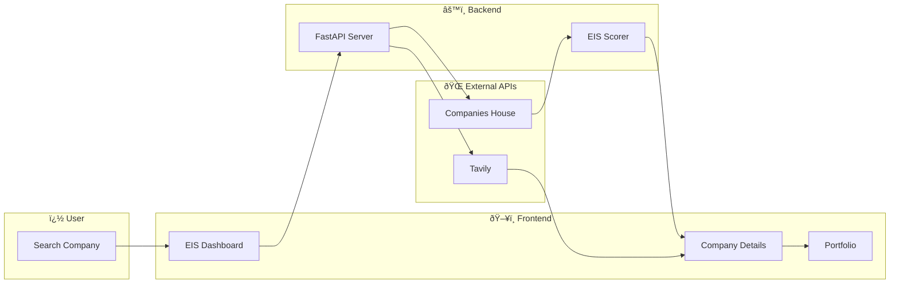

### Data Flow (Step by Step)

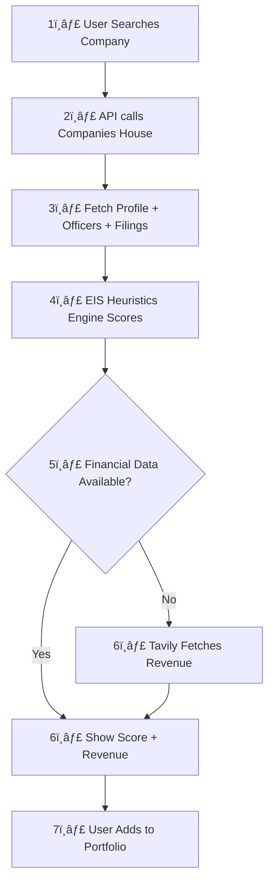

### Key Components

| Component | Technology | Purpose |
|-----------|------------|---------|
| **EIS Dashboard** | React + TypeScript | Main user interface |
| **Company Search** | Next.js API Routes | Search Companies House |
| **EIS Heuristics Engine** | Python | Calculate eligibility score |
| **Score Calculator** | Python | 0-100 scoring with factors |
| **Tavily Financial** | Tavily API | Fallback revenue lookup |

### Plugins & Presets Used

| Plugin/Library | Version | Purpose |
|----------------|---------|---------|
| **Next.js** | 14.x | React framework with App Router |
| **Tailwind CSS** | 3.x | Utility-first styling |
| **Framer Motion** | 10.x | Animations & transitions |
| **Lucide React** | Latest | Icon library |
| **Recharts** | 2.x | Data visualization |
| **FastAPI** | 0.100+ | Python REST API |
| **Pandas** | 2.x | Data processing |
| **httpx** | 0.24+ | Async HTTP client |

### EIS Scoring Factors


### Eligibility Logic Flow

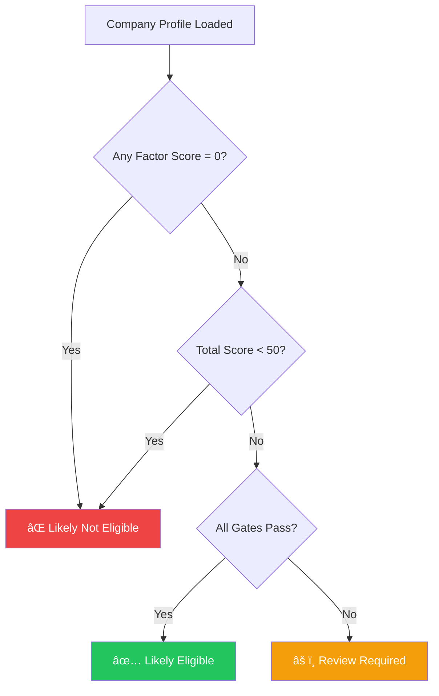

---

## 2. Company Research Agent

### Overview
The Research Agent performs deep company research using Tavily AI search, generating structured reports with PDF export and email delivery.

### Architecture Diagram


### Query Categories (16 Total Queries)

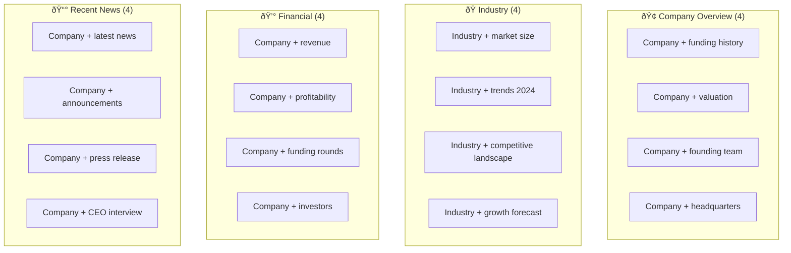

### API Endpoints

| Endpoint | Method | Purpose |
|----------|--------|---------|
| `/api/research/company` | POST | Trigger 16-query research |
| `/api/research/pdf` | POST | Generate WeasyPrint PDF |
| `/api/research/email` | POST | Send PDF via Gmail SMTP |

---

## 3. Newsletter Subscribe System

### Overview
The Subscribe system sends professional HTML emails with portfolio intelligence, AI company news, and eligibility analysis.

### Architecture Diagram


### Newsletter Sections

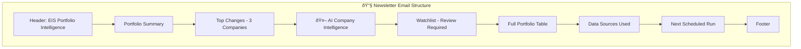

### Frequency Options

| Frequency | Next Run Calculation |
|-----------|---------------------|
| **Weekly** | Next Monday 08:00 |
| **Monthly** | 1st of Next Month 08:00 |
| **Yearly** | January 1st 08:00 |
| **Now** | Immediate (Manual) |

### Email Content Per Company

```
┌─────────────────────────────────────────────────────────────â”
│ COMPANY NAME (00000000) — Likely Not Eligible (Score: 78)  │
│ 💰 Revenue: £45.6M | 🢠Sector: Technology                  │
│ • Company Age score is 0/20                                 │
│ → Recommended: Remove from EIS candidate list               │
└─────────────────────────────────────────────────────────────┘
```

---

## 4. AI Newsroom

### Overview
The AI Newsroom provides real-time company news using Tavily search with HuggingFace AI summarization.

### Architecture Diagram

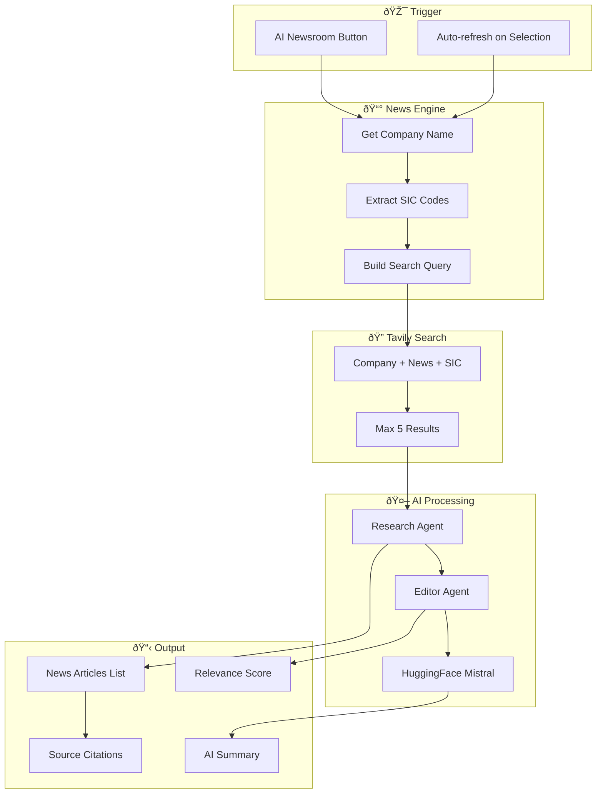

### News Card Display

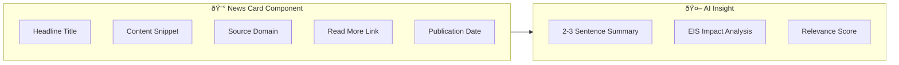

### API Flow

| Step | Endpoint | Data |
|------|----------|------|
| 1 | `/api/eis/company/id/news` | Company Number |
| 2 | Internal | Tavily Search Query |
| 3 | Internal | HuggingFace Summarization |
| 4 | Response | News + AI Summary |

---

## 5. AI Daily News

### Overview
The AI Daily News feature provides sector-wide EIS market intelligence updated daily.

### Architecture Diagram

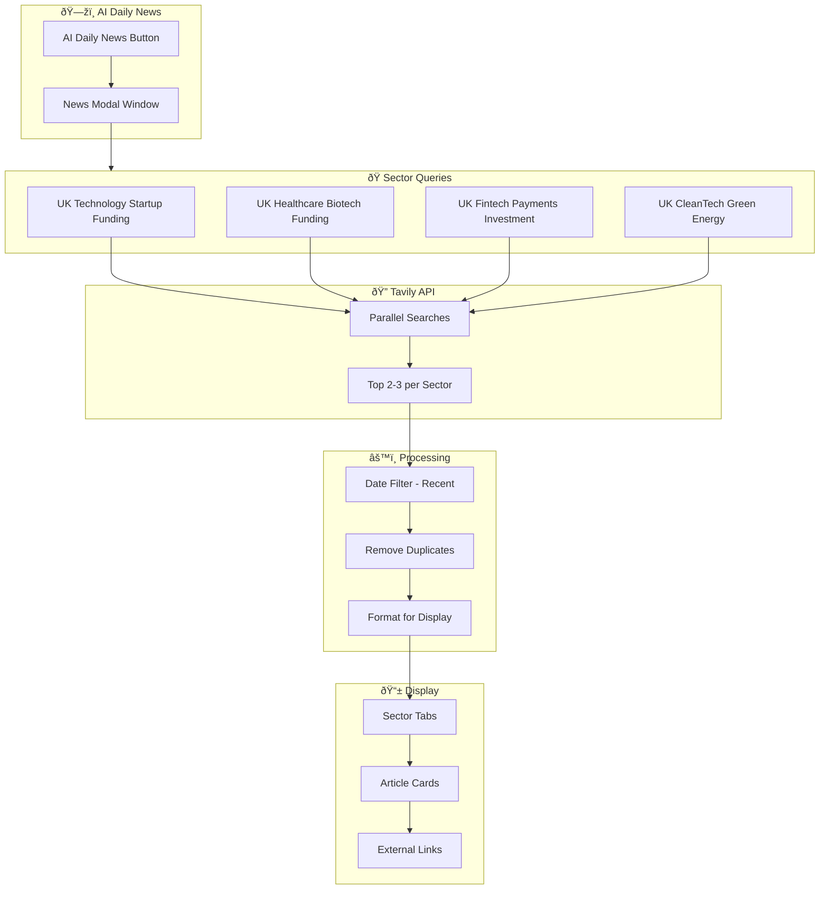

### Sector Categories

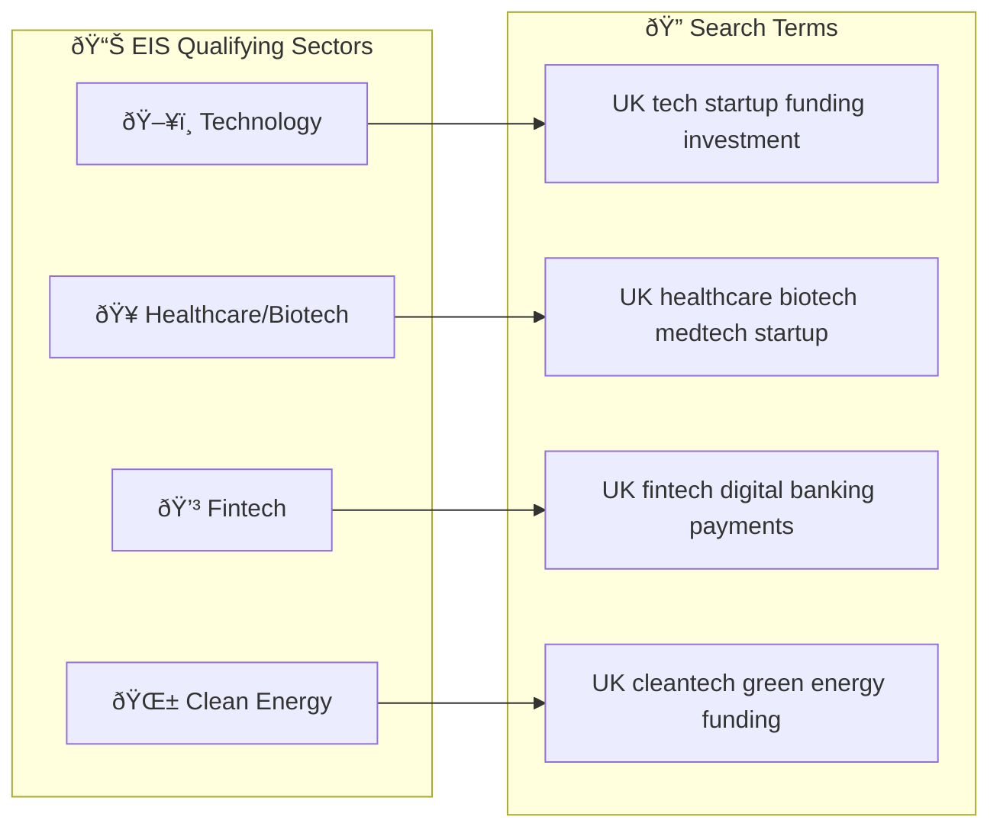

### News Display Format

```
┌─────────────────────────────────────────────────────────────â”
│ 📅 December 27, 2024                                        │
├─────────────────────────────────────────────────────────────┤
│ ðŸ–¥ï¸ TECHNOLOGY                                               │
│ ─────────────────────────────────────────────────────────── │
│ UK AI Startup Raises £50M Series B                          │
│ The London-based AI company has secured funding...          │
│ 📰 TechCrunch | Read More →                                 │
├─────────────────────────────────────────────────────────────┤
│ 🥠HEALTHCARE                                               │
│ ─────────────────────────────────────────────────────────── │
│ Biotech Firm Gets NHS Innovation Contract                   │
│ A Manchester biotech startup has won...                     │
│ 📰 The Guardian | Read More →                               │
└─────────────────────────────────────────────────────────────┘
```

---

## Technology Stack Summary


---

## 6. Portfolio Persistence System

### Overview
The Portfolio Persistence system allows users to save and load company portfolios across browser sessions using localStorage. It supports 5 independent save slots.

### Architecture

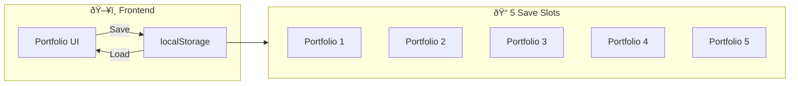

### Key Features

| Feature | Description |
|---------|-------------|
| **5 Save Slots** | Portfolio 1-5, each independent |
| **Auto-Load** | Last selected slot loads on page refresh |
| **Dropdown Selector** | Visual dropdown with company counts |
| **Save Button** | One-click save to current slot |
| **No Backend** | Pure frontend, uses `localStorage` |

### Data Structure

```json
{
  "eis_portfolios": {
    "1": [
      {
        "company_number": "12345678",
        "company_name": "Example Ltd",
        "eis_assessment": { "score": 85, "status": "Likely Eligible" },
        "sic_codes": ["62020"]
      }
    ],
    "2": [],
    "3": [],
    "4": [],
    "5": []
  },
  "eis_selected_slot": "1"
}
```

---

## 7. EIS Conversational Advisor (Ollama)

### Overview
The EIS Advisor is a multi-tool AI assistant powered by Ollama (local LLM). It can answer EIS eligibility questions, analyze companies, fetch news, and handle general knowledge questions.

### Architecture

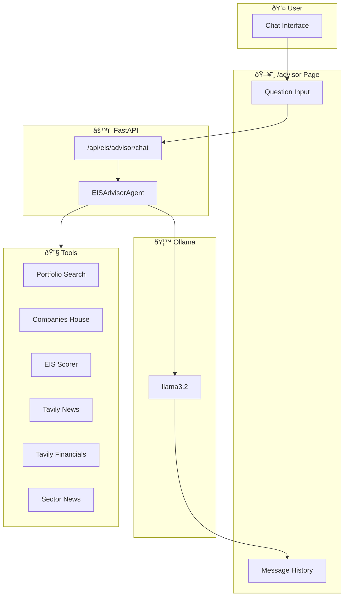

### Available Tools

| Tool | Purpose | Data Source |
|------|---------|-------------|
| `tool_search_portfolio` | Search saved companies | localStorage |
| `tool_lookup_company` | Get company details | Companies House API |
| `tool_calculate_eis` | Calculate EIS score | eis_heuristics.py |
| `tool_search_news` | Company news | Tavily API |
| `tool_get_financials` | Revenue/funding | Tavily API |
| `tool_sector_news` | Sector trends | Tavily API |

### Example Conversations

```
👤 User: "What makes a company EIS eligible?"

🤖 Advisor: "For EIS eligibility, companies must:
   - Be under 7 years old (or 10 for Knowledge Intensive)
   - Have under £15M gross assets
   - Have fewer than 250 employees
   - Not be in excluded sectors (property, legal, etc.)
   - Be an active UK company"

---

👤 User: "Analyze Revolut for EIS"

🤖 Advisor: "REVOLUT GROUP HOLDINGS LTD (12743369):
   📊 EIS Score: 45/100 (Not Eligible)
   
   ⌠Failed: Company Age (0/20) - Founded 2015
   ⌠Failed: Gross Assets exceed £15M
   ✅ Passed: Active UK company
   ✅ Passed: Technology sector eligible
   
   💰 Revenue: £1.8B (2023)"
```

### Setup Requirements

```bash
# Install Ollama
# Download from: https://ollama.com

# Pull the model
ollama pull llama3.2

# Verify
ollama list
```

### API Endpoints

| Endpoint | Method | Description |
|----------|--------|-------------|
| `/api/eis/advisor/chat` | POST | Send message to advisor |
| `/api/eis/advisor/status` | GET | Check Ollama availability |

### Important Notes

> [!NOTE]
> **Portfolio Data Structure**: The advisor handles both flat and nested data formats:
> ```json
> // Nested format (from localStorage)
> { "eis_assessment": { "score": 85, "status": "Likely Eligible" } }
> 
> // Flat format (legacy)
> { "eis_score": 85, "eis_status": "Likely Eligible" }
> ```

---

## Environment Configuration

```env
# Companies House API
COMPANIES_HOUSE_API_KEY=xxxxxxxxxx

# Tavily AI Search
TAVILY_API_KEY=tvly-xxxxxxxxxx

# HuggingFace LLM
HF_API_KEY=hf_xxxxxxxxxx

# Gmail SMTP
GMAIL_ADDRESS=your@gmail.com
GMAIL_APP_PASSWORD=xxxx-xxxx-xxxx-xxxx

# Ollama (optional, defaults to localhost)
OLLAMA_URL=http://localhost:11434
```

---

## Repository

**GitHub:** [nagasriramnani/Currency-Intelligence-Platform-V2](https://github.com/nagasriramnani/Currency-Intelligence-Platform-V2)

---

*Report Generated: December 29, 2025*  
*Version: 2.4.0*
