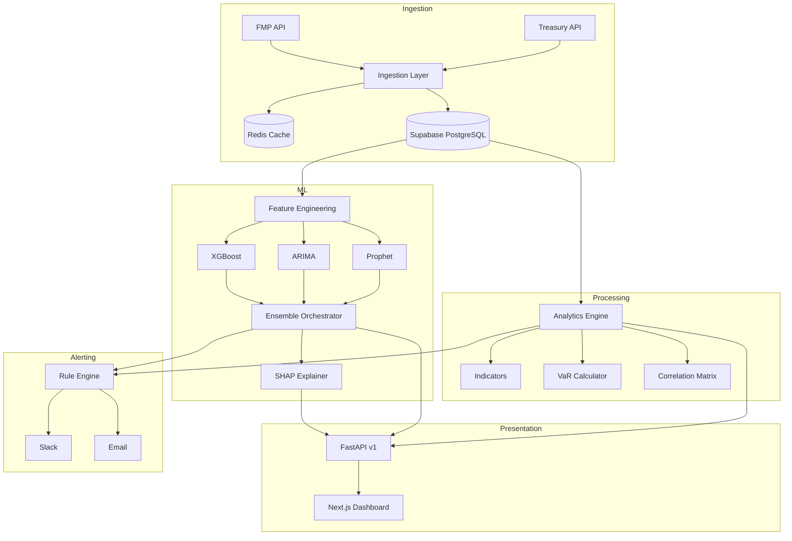

# Currency Intelligence Platform
## Evolution Roadmap: From MVP to Production-Grade System

---

## 1. High-Level Vision

Transform the Currency Intelligence Platform from a functional analytics dashboard into a **research-grade, commercially compelling** system that:

1. **Predicts** currency movements with quantified confidence
2. **Explains** why movements are expected (not just what)
3. **Recommends** hedging actions with risk-adjusted context
4. **Adapts** to regime changes without manual intervention

**Target Users**: Portfolio managers, FX traders, CFOs, risk committees

---

## 2. Technical Architecture Upgrades

### 2.1 Proposed Folder Structure

```
backend/
├── core/                    # Shared utilities, config, logging
│   ├── config.py
│   ├── database.py
│   └── scheduler.py
├── ingestion/               # Data acquisition layer
│   ├── treasury_client.py
│   ├── fmp_client.py
│   └── base_client.py       # Abstract interface
├── analytics/               # Indicator calculations
│   ├── indicators.py
│   ├── volatility.py
│   ├── var.py               # [NEW] Value-at-Risk
│   └── correlation.py       # [NEW] Regime detection
├── ml/                      # Machine Learning layer [NEW]
│   ├── models/
│   │   ├── prophet_model.py
│   │   ├── arima_model.py   # [NEW]
│   │   ├── xgboost_model.py # [NEW]
│   │   └── ensemble.py      # [NEW] Model orchestration
│   ├── training/
│   │   ├── trainer.py
│   │   ├── backtester.py    # [NEW]
│   │   └── drift_detector.py # [NEW]
│   ├── explainability/      # [NEW]
│   │   ├── shap_explainer.py
│   │   └── feature_importance.py
│   └── registry.py          # Model versioning
├── insights/
│   ├── narrative_engine.py
│   └── recommendation_engine.py # [NEW]
├── alerts/
│   ├── slack_notifier.py
│   ├── rule_engine.py       # [NEW] Config-driven rules
│   └── severity_classifier.py # [NEW]
├── api/
│   ├── v1/                  # [NEW] Versioned endpoints
│   │   ├── data.py
│   │   ├── analytics.py
│   │   ├── forecasts.py
│   │   └── alerts.py
│   └── server.py
├── jobs/                    # [NEW] Background tasks
│   ├── data_refresh.py
│   ├── model_retrain.py
│   └── alert_check.py
└── tests/
```

### 2.2 Data Flow Architecture



### 2.3 Supabase Integration

**Why Supabase?**
- Free tier with 500MB database + 2GB bandwidth
- Managed PostgreSQL (no DevOps)
- Built-in Row Level Security (RLS)
- Realtime subscriptions for live updates
- Easy Next.js + Python integration

**Database Schema:**

```sql
-- Supabase SQL Editor
create table fx_rates (
  id uuid default gen_random_uuid() primary key,
  currency_pair text not null,  -- 'EUR', 'GBP', 'CAD'
  rate decimal(10,6) not null,
  record_date date not null,
  source text default 'treasury',
  created_at timestamp with time zone default now(),
  unique(currency_pair, record_date)
);

create table forecasts (
  id uuid default gen_random_uuid() primary key,
  currency_pair text not null,
  forecast_date date not null,
  horizon_days int not null,
  point_forecast decimal(10,6),
  lower_bound decimal(10,6),
  upper_bound decimal(10,6),
  confidence_score decimal(3,2),
  model_weights jsonb,
  created_at timestamp with time zone default now()
);

create table alerts (
  id uuid default gen_random_uuid() primary key,
  severity text check (severity in ('info', 'warning', 'critical')),
  title text not null,
  message text,
  currency_pair text,
  acknowledged boolean default false,
  created_at timestamp with time zone default now()
);

-- Indexes for performance
create index idx_fx_rates_date on fx_rates(record_date desc);
create index idx_forecasts_currency on forecasts(currency_pair, forecast_date);
```

**Python Client Integration:**

```python
# backend/core/database.py
from supabase import create_client, Client
import os

def get_supabase_client() -> Client:
    return create_client(
        os.getenv("SUPABASE_URL"),
        os.getenv("SUPABASE_KEY")
    )

# Example: Insert FX rate
def save_fx_rate(currency: str, rate: float, date: str):
    supabase = get_supabase_client()
    supabase.table("fx_rates").upsert({
        "currency_pair": currency,
        "rate": rate,
        "record_date": date
    }).execute()

# Example: Get historical data
def get_fx_history(currency: str, days: int = 365):
    supabase = get_supabase_client()
    response = supabase.table("fx_rates") \
        .select("*") \
        .eq("currency_pair", currency) \
        .order("record_date", desc=True) \
        .limit(days) \
        .execute()
    return response.data
```

**Environment Variables (.env):**
```
SUPABASE_URL=https://your-project.supabase.co
SUPABASE_KEY=your-anon-key
```

---

## 3. ML/AI Roadmap

### 3.1 Ensemble Forecasting Architecture

| Model | Purpose | Strengths |
|-------|---------|-----------|
| **Prophet** | Baseline trend + seasonality | Handles missing data, interpretable |
| **ARIMA** | Short-term momentum | Fast, good for stationary series |
| **XGBoost** | Feature-rich prediction | Captures macro correlations |
| **LSTM** (Optional) | Long-range dependencies | Pattern recognition |

**Ensemble Strategy**: Weighted average based on rolling 30-day MAPE performance.

```python
# ml/models/ensemble.py
class EnsembleForecaster:
    def __init__(self):
        self.models = {
            'prophet': ProphetModel(weight=0.4),
            'arima': ARIMAModel(weight=0.3),
            'xgboost': XGBoostModel(weight=0.3)
        }
    
    def predict(self, currency: str, horizon: int) -> EnsembleForecast:
        predictions = {name: m.predict(currency, horizon) 
                       for name, m in self.models.items()}
        
        # Dynamic weight adjustment based on recent accuracy
        weights = self._calculate_dynamic_weights(currency)
        
        return EnsembleForecast(
            point_forecast=weighted_average(predictions, weights),
            confidence_interval=self._compute_interval(predictions),
            model_contributions=weights,
            trust_score=self._calibrate_confidence(predictions)
        )
```

### 3.2 Model Performance Tracking

| Metric | Description | Target |
|--------|-------------|--------|
| **MAPE** | Mean Absolute Percentage Error | < 3% |
| **Directional Accuracy** | % of correct up/down predictions | > 60% |
| **Calibration** | 80% CI should contain 80% of actuals | 75-85% |

### 3.3 Regime Detection

Use Hidden Markov Models (HMM) to classify market regimes:

| Regime | Characteristics | Strategy Implication |
|--------|-----------------|---------------------|
| **Low Volatility** | σ < 1 std, stable trends | Longer hedging horizons |
| **High Volatility** | σ > 2 std, frequent reversals | Reduce position sizes |
| **Trending** | Directional momentum > 3 months | Trend-following signals |
| **Mean-Reverting** | Oscillating within range | Range-bound strategies |

### 3.4 Explainability Framework

```python
# ml/explainability/shap_explainer.py
class ForecastExplainer:
    def explain(self, forecast: EnsembleForecast) -> Explanation:
        return Explanation(
            primary_driver="EUR weakening driven by ECB rate divergence",
            feature_contributions={
                "interest_rate_differential": +0.35,
                "oil_price_change": +0.15,
                "historical_seasonality": +0.20,
                "volatility_regime": -0.10
            },
            confidence_factors=[
                "High model agreement (3/3 models bullish)",
                "Similar pattern in 2019 had 72% accuracy"
            ]
        )
```

### 3.5 Drift Detection & Retraining

| Trigger | Threshold | Action |
|---------|-----------|--------|
| **MAPE Spike** | > 5% for 7 days | Auto-retrain |
| **Regime Shift** | HMM state change | Adjust model weights |
| **Data Distribution** | KL divergence > 0.1 | Alert + manual review |

---

## 4. Advanced Analytics & Financial Intelligence

### 4.1 Value-at-Risk (VaR) Implementation

```python
# analytics/var.py
class VaRCalculator:
    def calculate(self, portfolio: Portfolio, horizon: int = 1) -> VaRResult:
        return VaRResult(
            var_95=self._parametric_var(0.95),
            var_99=self._parametric_var(0.99),
            cvar_95=self._conditional_var(0.95),  # Expected Shortfall
            stress_scenarios=[
                StressScenario("2008 GFC", impact=-12.5),
                StressScenario("Brexit Vote", impact=-8.2),
                StressScenario("COVID Crash", impact=-15.3)
            ]
        )
```

### 4.2 Hedging Recommendations

| Scenario | Recommendation | Rationale |
|----------|---------------|-----------|
| EUR exposure + high volatility | Buy EUR puts | Downside protection |
| USD strengthening trend | Delay CAD conversions | Wait for better rates |
| GBP-CAD correlation > 0.8 | Hedge only one | Natural offset |

---

## 5. UI/UX Improvements

### 5.1 Executive vs Analyst Views

| Feature | Executive View | Analyst View |
|---------|---------------|--------------|
| **Metrics** | 3 KPIs with trends | Full indicator panel |
| **Charts** | Summary sparklines | Interactive drilldowns |
| **Forecasts** | Direction + confidence | Model breakdowns |
| **Actions** | "Hedge Now" buttons | Parameter controls |

### 5.2 Explain Panels (Example)

```
┌─────────────────────────────────────────────────────────┐
│ 📊 EUR Forecast: -2.3% over 3 months                    │
├─────────────────────────────────────────────────────────┤
│ 🎯 Confidence: 72% (High)                               │
│                                                         │
│ Why this forecast?                                      │
│ ┌─────────────────────────────────────────────────────┐ │
│ │ • ECB rate decision diverging from Fed (+35%)       │ │
│ │ • October seasonality historically weak (+20%)      │ │
│ │ • Oil price correlation (+15%)                      │ │
│ │ • Current volatility regime is stable (-10%)        │ │
│ └─────────────────────────────────────────────────────┘ │
│                                                         │
│ Model Agreement: Prophet ✓ | ARIMA ✓ | XGBoost ✓       │
│                                                         │
│ [View Historical Accuracy] [Export to PDF]             │
└─────────────────────────────────────────────────────────┘
```

### 5.3 Scenario Comparison View

| Scenario | EUR | GBP | CAD | Portfolio Impact |
|----------|-----|-----|-----|-----------------|
| **Base Case** | -2.3% | +1.1% | -0.8% | -$45,000 |
| **Stress (2008)** | -12.5% | -8.2% | -15.3% | -$312,000 |
| **Optimistic** | +3.2% | +2.8% | +1.5% | +$89,000 |

---

## 6. Alerting & Decision Automation

### 6.1 Context-Aware Alerts

```
🔴 CRITICAL: EUR Volatility Spike

What: EUR 30-day volatility jumped to 18.2% (3.2 std above mean)
Why: ECB emergency meeting speculation + Italian bond spreads widening
Risk: VaR 95% increased from $45K to $78K
Action: Consider reducing EUR exposure by 15% or buying puts

[Acknowledge] [Snooze 4h] [View Details]
```

### 6.2 Severity Classification

| Level | Criteria | Channel | Response Time |
|-------|----------|---------|---------------|
| **Info** | FYI updates | Slack | None required |
| **Warning** | Threshold breach | Slack + Dashboard badge | Same day |
| **Critical** | VaR breach, anomaly | Slack + Email + SMS | Immediate |

---

## 7. Business & Commercial Layer

### 7.1 User Personas

| Persona | Role | Key Needs |
|---------|------|-----------|
| **CFO Sarah** | Strategic oversight | Board-ready summaries, risk exposure |
| **Trader Mike** | Daily decisions | Real-time signals, quick actions |
| **Risk Officer Tom** | Compliance | VaR reports, audit trails, limits |
| **Analyst Jane** | Research | Model deep-dives, backtests |

### 7.2 Decisions Enabled

1. **When to hedge**: Model confidence + direction + volatility regime
2. **How much to hedge**: VaR-based position sizing
3. **Which instruments**: Cross-currency correlation recommendations
4. **When to rebalance**: Regime shift alerts

### 7.3 Commercial Positioning

| Frame | Value Proposition |
|-------|------------------|
| **KTP Deliverable** | Demonstrates enterprise engineering + ML capability |
| **Internal Tool** | Replaces Bloomberg terminal for FX analytics |
| **SaaS Product** | Multi-tenant FX intelligence for mid-market firms |

---

## 8. Development Milestones

### Phase 1: Foundation (Weeks 1-4)
- [ ] Setup Supabase project & tables (fx_rates, forecasts, alerts)
- [ ] Implement Supabase Python client integration
- [ ] Implement Redis caching (optional: use Supabase realtime instead)
- [ ] Create API versioning (v1/)
- [ ] Add background job scheduler (APScheduler)

### Phase 2: ML Evolution (Weeks 5-8)
- [ ] Add ARIMA model
- [ ] Add XGBoost model
- [ ] Build ensemble orchestrator
- [ ] Implement rolling backtest framework
- [ ] Add SHAP explainability

### Phase 3: Risk Analytics (Weeks 9-10)
- [ ] Implement VaR calculator
- [ ] Add stress testing scenarios
- [ ] Build regime detection (HMM)
- [ ] Create hedging recommendation engine

### Phase 4: UI/UX Polish (Weeks 11-12)
- [ ] Executive dashboard view
- [ ] Explain panels for forecasts
- [ ] PDF report export
- [ ] Scenario comparison table

### Phase 5: Production Hardening (Ongoing)
- [ ] Model drift monitoring
- [ ] Alert severity classification
- [ ] Performance dashboards
- [ ] Documentation & API contracts

### Phase 6: EIS Enhancements (Completed)
- [x] Mandatory eligibility gates (6 gates)
- [x] EIS Advisor AI chat (Ollama llama3.2)
- [x] Portfolio management (5 slots)
- [x] Failed gates UI display
- [x] 7-year age rule with KIC exception
- [x] Remove from portfolio functionality

### Phase 7: Azure Production Deployment (Planned)
- [ ] Azure Static Web Apps (Frontend)
- [ ] Azure App Service (Backend)
- [ ] Azure OpenAI Service (Replace Ollama)
- [ ] Azure Cosmos DB (Replace JSON files)
- [ ] Azure Key Vault (Secrets management)
- [ ] Azure Redis Cache (Session/rate limiting)
- [ ] CI/CD with GitHub Actions

### Azure Architecture Target

```
┌─────────────────────────────────────────────────────────────────┐
│                    AZURE PRODUCTION STACK                        │
├─────────────────────────────────────────────────────────────────┤
│  Azure Static Web Apps ───▶ Azure App Service (FastAPI)         │
│         │                          │                             │
│         │                    ┌─────┴─────┐                       │
│         │                    ▼           ▼                       │
│         │              Azure OpenAI    Azure Cosmos DB           │
│         │              (GPT-4)         (NoSQL)                   │
│         │                                                        │
│  Azure Key Vault ◀─── Secrets Management ───▶ Azure Redis       │
└─────────────────────────────────────────────────────────────────┘
```

### Estimated Azure Costs (Monthly)

| Service | Tier | ~Cost |
|---------|------|-------|
| Static Web Apps | Free | $0 |
| App Service | B1 | $13 |
| Azure OpenAI | Pay-per-use | $20-50 |
| Cosmos DB | Serverless | $5-15 |
| Redis Cache | Basic | $16 |
| **TOTAL** | | **~$60-100** |

---

## 9. Key Differentiators vs Basic FX Dashboard

| Basic Dashboard | Currency Intelligence Platform |
|-----------------|-------------------------------|
| Shows current rates | **Predicts** future rates |
| Static charts | **Explains** why movements occur |
| Manual alerts | **Recommends** actions |
| Single model | **Ensemble** with confidence |
| Historical only | **Forward-looking** risk scenarios |

---

## 10. EIS Scanner Differentiators

| Basic Screening | Sapphire EIS Scanner |
|-----------------|---------------------|
| Manual eligibility check | **Automated** 6-gate screening |
| Single score | **Detailed factors** with explanations |
| No AI assistance | **AI Advisor** chat with Ollama |
| Static portfolio | **Persistent** 5-slot portfolio |
| Generic results | **Failed gates** clearly shown |

---

*Document Version: 2.0 | January 2026*
