# EIS Investment Scanner - Architecture Documentation

> **Sapphire Intelligence Platform** — Enterprise Investment Scheme Analysis System  
> *Last Updated: December 27, 2024*

---

## Table of Contents

1. [EIS Page Complete Workflow](#1-eis-page-complete-workflow)
2. [Company Research Agent](#2-company-research-agent)
3. [Subscribe & Newsletter System](#3-subscribe--newsletter-system)
4. [AI Newsroom](#4-ai-newsroom)
5. [AI Daily News](#5-ai-daily-news)

---

## 1. EIS Page Complete Workflow

### Overview

The EIS Investment Scanner page is the main interface for screening UK companies for Enterprise Investment Scheme eligibility. It combines real-time Companies House data with AI-powered analysis.

### Architecture Diagram


### Key Components

| Component | Technology | Purpose |
|-----------|------------|---------|
| **Search Bar** | React + Debounce | Real-time company search |
| **Company Profile** | Companies House API | Full company data |
| **EIS Engine** | Python Heuristics | 0-100 eligibility scoring |
| **Stats Grid** | React Cards | Directors, PSCs, Age, Revenue |
| **Eligibility Gates** | Visual Indicators | Pass/Fail for key criteria |
| **Score Breakdown** | Progress Bars | Factor-by-factor scoring |

### Plugins & Libraries Used

| Library | Version | Purpose |
|---------|---------|---------|
| `next` | 14.x | React framework |
| `framer-motion` | 10.x | Animations |
| `lucide-react` | latest | Icons |
| `tailwindcss` | 3.x | Styling |
| `fastapi` | 0.100+ | Python API |
| `tavily-python` | 0.3+ | News search |
| `huggingface-hub` | 0.19+ | AI summarization |

### Eligibility Scoring Logic

```mermaid
flowchart LR
    subgraph Factors["Score Factors (0-100)"]
        F1[Company Age<br/>≤7 years = +20]
        F2[Company Status<br/>Active = +15]
        F3[SIC Codes<br/>Eligible = +20]
        F4[Insolvency<br/>None = +15]
        F5[Excluded Trades<br/>None = +15]
        F6[R&D/KI<br/>Yes = +15]
    end

    subgraph Logic["Eligibility Logic"]
        Check{Any Factor = 0?}
        Score{Total < 50?}
        Eligible[✅ Likely Eligible]
        NotEligible[❌ Likely Not Eligible]
    end

    F1 --> Check
    F2 --> Check
    F3 --> Check
    F4 --> Check
    F5 --> Check
    F6 --> Check
    
    Check -->|Yes| NotEligible
    Check -->|No| Score
    Score -->|Yes| NotEligible
    Score -->|No| Eligible

    style Eligible fill:#10b981,color:#fff
    style NotEligible fill:#ef4444,color:#fff
```



---

## 2. Company Research Agent

### Overview

The Research Agent performs deep-dive company research using Tavily AI search, generating comprehensive reports with PDF export and email delivery.

### Architecture Diagram

```mermaid
flowchart TB
    subgraph UI["🖥️ Research Page (/research)"]
        Form[Company Input Form]
        Examples[Example Companies<br/>Spotify, Revolut, Stripe, Notion]
        Progress[Research Progress Indicator]
        Report[Structured Report Display]
        Actions[Copy | PDF | Email]
    end

    subgraph Backend["⚙️ Research API"]
        ResearchEndpoint["/api/research/company"]
        PDFEndpoint["/api/research/pdf"]
        EmailEndpoint["/api/research/email"]
        Researcher[CompanyResearcher Class]
    end

    subgraph Tavily["🔍 Tavily AI Search"]
        Q1[Company Overview Queries<br/>4 queries]
        Q2[Industry Analysis Queries<br/>4 queries]
        Q3[Financial Data Queries<br/>4 queries]
        Q4[Recent News Queries<br/>4 queries]
    end

    subgraph Output["📄 Output Generation"]
        PDFGen[WeasyPrint PDF Generator]
        EmailSend[Gmail SMTP Sender]
        JSONReport[JSON Report Structure]
    end

    %% Flow
    Form -->|"Company Name + Industry"| ResearchEndpoint
    Examples -->|"Quick Fill"| Form
    
    ResearchEndpoint --> Researcher
    Researcher -->|"16 Parallel Queries"| Tavily
    
    Tavily --> Q1
    Tavily --> Q2
    Tavily --> Q3
    Tavily --> Q4
    
    Q1 -->|"Aggregate"| JSONReport
    Q2 -->|"Aggregate"| JSONReport
    Q3 -->|"Aggregate"| JSONReport
    Q4 -->|"Aggregate"| JSONReport
    
    JSONReport --> Progress
    Progress --> Report
    Report --> Actions
    
    Actions -->|"Download PDF"| PDFEndpoint
    Actions -->|"Send Email"| EmailEndpoint
    
    PDFEndpoint --> PDFGen
    EmailEndpoint --> EmailSend
    EmailSend -->|"PDF Attachment"| User((📧 User Email))

    style UI fill:#1e293b,stroke:#3b82f6,color:#fff
    style Backend fill:#0f172a,stroke:#10b981,color:#fff
    style Tavily fill:#18181b,stroke:#a855f7,color:#fff
    style Output fill:#18181b,stroke:#f59e0b,color:#fff
```

### Research Query Categories

| Category | Queries | Example |
|----------|---------|---------|
| **Company Overview** | 4 | "Spotify funding history valuation headquarters" |
| **Industry Analysis** | 4 | "Music streaming market size trends competitors" |
| **Financial Data** | 4 | "Spotify revenue growth profitability 2024" |
| **Recent News** | 4 | "Spotify latest news announcements 2024" |

### Report Structure

```mermaid
flowchart LR
    subgraph Report["📊 Research Report"]
        H[Header: Company + Date]
        S1[1. Company Overview]
        S2[2. Industry Analysis]
        S3[3. Financial Overview]
        S4[4. Recent News]
        M[Metadata: Sources, Query Count]
    end

    H --> S1 --> S2 --> S3 --> S4 --> M

    style Report fill:#1e293b,stroke:#3b82f6,color:#fff
```



---

## 3. Subscribe & Newsletter System

### Overview

The Subscribe system allows users to receive periodic EIS portfolio updates via email with AI-generated company intelligence.

### Architecture Diagram

```mermaid
flowchart TB
    subgraph Frontend["🖥️ Subscribe Modal"]
        SubBtn[Subscribe Button]
        Modal[Subscription Modal]
        FreqSelect[Frequency Selector<br/>Weekly | Monthly | Yearly | Now]
        EmailInput[Email Address Input]
        SendBtn[Send Newsletter]
    end

    subgraph Backend["⚙️ Newsletter API"]
        SendEmail["/api/eis/automation/send-email"]
        Mailer[ProfessionalNewsletterGenerator]
        Writer[EISWriter]
    end

    subgraph DataSources["📊 Data Sources"]
        Portfolio[Portfolio Companies]
        ScanHistory[Scan History]
        CH[Companies House]
        TavilyNews[Tavily News Search]
        HFSummary[HuggingFace Summarizer]
    end

    subgraph EmailGen["📧 Email Generation"]
        HTML[HTML Template]
        PlainText[Plain Text Fallback]
        Subject[Dynamic Subject Line]
    end

    subgraph Sections["📄 Newsletter Sections"]
        S1[Portfolio Summary]
        S2[Top Changes + Revenue]
        S3[🤖 AI Company Intelligence]
        S4[Watchlist]
        S5[Full Portfolio Table]
        S6[Data Sources]
        S7[Next Scheduled Run]
    end

    %% Flow
    SubBtn --> Modal
    Modal --> FreqSelect
    Modal --> EmailInput
    FreqSelect --> SendBtn
    EmailInput --> SendBtn
    
    SendBtn -->|"POST"| SendEmail
    
    SendEmail --> Portfolio
    SendEmail --> ScanHistory
    
    Portfolio -->|"Company Data"| CH
    Portfolio -->|"News Search"| TavilyNews
    TavilyNews -->|"Summarize"| HFSummary
    
    CH --> Writer
    HFSummary --> Writer
    
    Writer --> Mailer
    Mailer --> HTML
    Mailer --> PlainText
    Mailer --> Subject
    
    HTML --> S1
    HTML --> S2
    HTML --> S3
    HTML --> S4
    HTML --> S5
    HTML --> S6
    HTML --> S7
    
    S7 -->|"SMTP"| Gmail((📧 Gmail))
    Gmail --> User((👤 Recipient))

    style Frontend fill:#1e293b,stroke:#3b82f6,color:#fff
    style Backend fill:#0f172a,stroke:#10b981,color:#fff
    style DataSources fill:#18181b,stroke:#a855f7,color:#fff
    style EmailGen fill:#18181b,stroke:#f59e0b,color:#fff
```

### Newsletter Content Flow

```mermaid
flowchart LR
    subgraph Input["Input Data"]
        Companies[Portfolio Companies]
        Frequency[Selected Frequency]
    end

    subgraph Processing["Processing"]
        Lookup[Companies House Lookup]
        News[Tavily News Fetch]
        Eligibility[Zero-Score Check]
        Revenue[Revenue Lookup]
    end

    subgraph Output["Email Output"]
        Header[EIS Portfolio Intelligence<br/>Weekly Snapshot - Date]
        Summary[📊 X companies, Y eligible]
        TopChanges[Top 3 with Revenue + Status]
        AINews[🤖 AI Company News]
        Table[Full Portfolio Table]
    end

    Companies --> Lookup
    Companies --> News
    Lookup --> Eligibility
    Lookup --> Revenue
    News --> AINews
    
    Eligibility --> TopChanges
    Revenue --> TopChanges
    
    Frequency --> Header
    Header --> Summary --> TopChanges --> AINews --> Table

    style Input fill:#1e293b,stroke:#3b82f6,color:#fff
    style Processing fill:#0f172a,stroke:#10b981,color:#fff
    style Output fill:#18181b,stroke:#f59e0b,color:#fff
```



### Frequency Options

| Frequency | Next Run Calculation |
|-----------|---------------------|
| **Weekly** | Next Monday 08:00 |
| **Monthly** | 1st of next month 08:00 |
| **Yearly** | January 1st 08:00 |
| **Now** | Immediate send |

---

## 4. AI Newsroom

### Overview

The AI Newsroom provides real-time news for individual companies using Tavily search with HuggingFace AI summarization.

### Architecture Diagram


### News Processing Pipeline


---

## 5. AI Daily News

### Overview

AI Daily News provides sector-level market intelligence with the latest funding, investment, and startup news across EIS-relevant sectors.

### Architecture Diagram

```mermaid
flowchart TB
    subgraph UI["🖥️ AI Daily News Page"]
        DailyBtn[✨ AI Daily News Button]
        NewsPage[Daily News Page]
        SectorTabs[Sector Tabs:<br/>Technology | Healthcare | Fintech | Clean Energy]
        NewsFeed[News Feed]
        Filters[Date & Relevance Filters]
    end

    subgraph Backend["⚙️ Daily News API"]
        DailyEndpoint["/api/eis/daily-news"]
        SectorQueries[Sector-Specific Queries]
    end

    subgraph Tavily["🔍 Tavily Sector Search"]
        TechQ[Tech: UK startup funding 2024]
        HealthQ[Healthcare: biotech medtech UK]
        FintechQ[Fintech: digital banking payments]
        CleanQ[Clean Energy: cleantech green]
    end

    subgraph Processing["📊 Processing"]
        Aggregate[Aggregate Results]
        Dedupe[Deduplicate]
        Sort[Sort by Date/Relevance]
        Format[Format for Display]
    end

    subgraph Output["📰 News Display"]
        Card1[News Card: Title + Summary]
        Card2[Source Badge + Link]
        Card3[Sector Tag]
        Card4[Published Date]
    end

    %% Flow
    DailyBtn --> NewsPage
    NewsPage --> SectorTabs
    SectorTabs --> DailyEndpoint
    
    DailyEndpoint --> SectorQueries
    SectorQueries --> TechQ
    SectorQueries --> HealthQ
    SectorQueries --> FintechQ
    SectorQueries --> CleanQ
    
    TechQ --> Tavily
    HealthQ --> Tavily
    FintechQ --> Tavily
    CleanQ --> Tavily
    
    Tavily --> Aggregate
    Aggregate --> Dedupe
    Dedupe --> Sort
    Sort --> Format
    
    Format --> NewsFeed
    NewsFeed --> Card1
    NewsFeed --> Card2
    NewsFeed --> Card3
    NewsFeed --> Card4
    
    Filters --> Sort

    style UI fill:#1e293b,stroke:#3b82f6,color:#fff
    style Backend fill:#0f172a,stroke:#10b981,color:#fff
    style Tavily fill:#18181b,stroke:#a855f7,color:#fff
    style Processing fill:#18181b,stroke:#10b981,color:#fff
    style Output fill:#18181b,stroke:#f59e0b,color:#fff
```

### Sector Query Configuration

| Sector | Search Query | Focus |
|--------|--------------|-------|
| **Technology** | UK technology startup funding investment Series A 2024 | Software, AI, SaaS |
| **Healthcare** | UK healthcare biotech medtech startup funding | Diagnostics, Therapeutics |
| **Fintech** | UK fintech digital banking payments startup investment | Payments, InsurTech |
| **Clean Energy** | UK cleantech green energy clean technology funding | Renewables, Battery |

### Data Flow


---

## Complete System Architecture


---

## Environment Variables Required

```env
# Companies House API
COMPANIES_HOUSE_API_KEY=your_api_key

# Tavily AI Search
TAVILY_API_KEY=tvly-xxxxxxxxxxxx

# HuggingFace (Mistral 7B)
HF_API_KEY=hf_xxxxxxxxxxxx

# Gmail SMTP
GMAIL_ADDRESS=your_email@gmail.com
GMAIL_APP_PASSWORD=your_app_password

# Slack (Optional)
SLACK_WEBHOOK_URL=https://hooks.slack.com/...
```

---

*Generated: December 27, 2024*  
*Sapphire Intelligence Platform v2.2.0*
