# EIS Investment Scanner - Architecture Documentation

> **Sapphire Intelligence Platform** — Enterprise Investment Scheme Analysis System  
> *Last Updated: December 27, 2024*

---

## Table of Contents

1. [EIS Page Complete Workflow](#1-eis-page-complete-workflow)
2. [Company Research Agent](#2-company-research-agent)
3. [Subscribe & Newsletter System](#3-subscribe--newsletter-system)
4. [AI Newsroom](#4-ai-newsroom)
5. [AI Daily News](#5-ai-daily-news)

---

## 1. EIS Page Complete Workflow

### Overview

The **EIS Investment Scanner** is the core feature of the Sapphire Intelligence Platform. It allows investors and analysts to screen UK companies for **Enterprise Investment Scheme (EIS) eligibility** — a UK tax relief program that provides significant tax benefits for investing in qualifying small, high-risk companies.

### What It Does

When a user searches for a company:

1. **Search Phase**: The system queries the UK Companies House API to find matching companies by name or registration number
2. **Data Collection**: For a selected company, it fetches comprehensive data including company profile, directors, shareholders (PSCs), charges, and filing history
3. **EIS Scoring**: A heuristic engine analyzes the data against HMRC EIS criteria and calculates a 0-100 eligibility score
4. **Revenue Lookup**: If financial data is missing from Companies House, the system uses Tavily AI to search for revenue/funding information
5. **Display**: Results are displayed with visual indicators showing eligibility gates, score breakdown, and risk factors

### Architecture Diagram


### How Each Component Works

#### 1. Search Bar
- **Technology**: React with debounced input (300ms delay)
- **Behavior**: As user types, the frontend waits 300ms after last keystroke, then calls `/api/eis/search?q=company_name`
- **Results**: Returns up to 30 matching companies with name, number, address, and status

#### 2. Company Profile API
- **Endpoint**: `GET /api/eis/company/{company_number}/full-profile`
- **Data Sources**: Makes 5 parallel calls to Companies House:
  - Company profile (name, status, incorporation date, SIC codes)
  - Officers (directors, secretaries, resigned officers)
  - PSCs (persons with significant control - shareholders >25%)
  - Charges (mortgages, loans, security interests)
  - Filing history (annual accounts, confirmation statements)

#### 3. EIS Heuristics Engine
The scoring engine evaluates 6 key factors based on HMRC EIS rules:

| Factor | Max Points | Logic |
|--------|------------|-------|
| **Company Age** | 20 | ≤7 years old = full points, >7 years = 0 points |
| **Company Status** | 15 | "Active" = full points, Dissolved/Liquidated = 0 |
| **SIC Codes** | 20 | Checks against excluded trade list (property, legal, financial services) |
| **Insolvency** | 15 | No insolvency history = full points |
| **Excluded Trades** | 15 | Not in excluded activities list |
| **R&D/Knowledge Intensive** | 15 | Bonus for tech/research SIC codes |

#### 4. Smart Eligibility Detection
```
IF any_factor_score == 0:
    status = "Likely Not Eligible" (RED badge)
ELIF total_score < 50:
    status = "Likely Not Eligible" (RED badge)
ELSE:
    status = "Likely Eligible" (GREEN badge)
```

#### 5. Revenue Lookup (Tavily Fallback)
When Companies House has no accounts data:
1. Constructs query: `"{company_name} UK company revenue funding valuation 2024"`
2. Calls Tavily AI search API
3. Parses response for financial figures using regex patterns
4. Extracts amounts like "£1.5M", "£200K", "$50 billion"
5. Displays in Stats Grid

### Key Components

| Component | Technology | Purpose |
|-----------|------------|---------|
| **Search Bar** | React + Debounce | Real-time company search with 300ms delay |
| **Company Profile** | Companies House API | Fetches 5 data categories in parallel |
| **EIS Engine** | Python Heuristics | Calculates 0-100 score from 6 factors |
| **Stats Grid** | React Cards (5 columns) | Directors, PSCs, Share Allotments, Age, Revenue |
| **Eligibility Gates** | Visual Indicators | Pass/Fail icons for Status, SIC, Independence gates |
| **Score Breakdown** | Progress Bars | Shows each factor's contribution |

### Plugins & Libraries Used

| Library | Version | Purpose |
|---------|---------|---------|
| `next` | 14.x | React framework with App Router |
| `framer-motion` | 10.x | Smooth animations and transitions |
| `lucide-react` | latest | Icon library (Users, Shield, Clock, Banknote, etc.) |
| `tailwindcss` | 3.x | Utility-first CSS styling |
| `fastapi` | 0.100+ | Python async API framework |
| `tavily-python` | 0.3+ | AI-powered news and data search |
| `huggingface-hub` | 0.19+ | LLM inference for summarization |

### Eligibility Scoring Logic

```mermaid
flowchart LR
    subgraph Factors["Score Factors (0-100)"]
        F1[Company Age<br/>≤7 years = +20]
        F2[Company Status<br/>Active = +15]
        F3[SIC Codes<br/>Eligible = +20]
        F4[Insolvency<br/>None = +15]
        F5[Excluded Trades<br/>None = +15]
        F6[R&D/KI<br/>Yes = +15]
    end

    subgraph Logic["Eligibility Logic"]
        Check{Any Factor = 0?}
        Score{Total < 50?}
        Eligible[✅ Likely Eligible]
        NotEligible[❌ Likely Not Eligible]
    end

    F1 --> Check
    F2 --> Check
    F3 --> Check
    F4 --> Check
    F5 --> Check
    F6 --> Check
    
    Check -->|Yes| NotEligible
    Check -->|No| Score
    Score -->|Yes| NotEligible
    Score -->|No| Eligible

    style Eligible fill:#10b981,color:#fff
    style NotEligible fill:#ef4444,color:#fff
```



---

## 2. Company Research Agent

### Overview

The **Company Research Agent** is a deep-dive research tool that generates comprehensive company reports using AI. Unlike the EIS Scanner which focuses on eligibility, this tool provides detailed business intelligence including funding history, market analysis, financials, and recent news.

### What It Does

1. **Input**: User enters a company name and optional industry
2. **Research**: System fires 16 parallel Tavily queries across 4 categories
3. **Aggregation**: Results are deduplicated and structured into sections
4. **Output**: Report is displayed with options to copy, download PDF, or email

### Why 16 Queries?

Each category uses 4 different query variations to maximize coverage:

| Category | Query Examples |
|----------|----------------|
| **Company Overview** | "Spotify funding history", "Spotify headquarters team", "Spotify valuation 2024", "Spotify investors backers" |
| **Industry Analysis** | "Music streaming market size", "Audio streaming competitors", "Podcast industry trends", "Digital music market 2024" |
| **Financial Data** | "Spotify revenue 2024", "Spotify profitability", "Spotify growth rate", "Spotify financial performance" |
| **Recent News** | "Spotify latest news", "Spotify announcements 2024", "Spotify press release", "Spotify updates December 2024" |

### Architecture Diagram

```mermaid
flowchart TB
    subgraph UI["🖥️ Research Page (/research)"]
        Form[Company Input Form]
        Examples[Example Companies<br/>Spotify, Revolut, Stripe, Notion]
        Progress[Research Progress Indicator]
        Report[Structured Report Display]
        Actions[Copy | PDF | Email]
    end

    subgraph Backend["⚙️ Research API"]
        ResearchEndpoint["/api/research/company"]
        PDFEndpoint["/api/research/pdf"]
        EmailEndpoint["/api/research/email"]
        Researcher[CompanyResearcher Class]
    end

    subgraph Tavily["🔍 Tavily AI Search"]
        Q1[Company Overview Queries<br/>4 queries]
        Q2[Industry Analysis Queries<br/>4 queries]
        Q3[Financial Data Queries<br/>4 queries]
        Q4[Recent News Queries<br/>4 queries]
    end

    subgraph Output["📄 Output Generation"]
        PDFGen[WeasyPrint PDF Generator]
        EmailSend[Gmail SMTP Sender]
        JSONReport[JSON Report Structure]
    end

    %% Flow
    Form -->|"Company Name + Industry"| ResearchEndpoint
    Examples -->|"Quick Fill"| Form
    
    ResearchEndpoint --> Researcher
    Researcher -->|"16 Parallel Queries"| Tavily
    
    Tavily --> Q1
    Tavily --> Q2
    Tavily --> Q3
    Tavily --> Q4
    
    Q1 -->|"Aggregate"| JSONReport
    Q2 -->|"Aggregate"| JSONReport
    Q3 -->|"Aggregate"| JSONReport
    Q4 -->|"Aggregate"| JSONReport
    
    JSONReport --> Progress
    Progress --> Report
    Report --> Actions
    
    Actions -->|"Download PDF"| PDFEndpoint
    Actions -->|"Send Email"| EmailEndpoint
    
    PDFEndpoint --> PDFGen
    EmailEndpoint --> EmailSend
    EmailSend -->|"PDF Attachment"| User((📧 User Email))

    style UI fill:#1e293b,stroke:#3b82f6,color:#fff
    style Backend fill:#0f172a,stroke:#10b981,color:#fff
    style Tavily fill:#18181b,stroke:#a855f7,color:#fff
    style Output fill:#18181b,stroke:#f59e0b,color:#fff
```

### How Each Component Works

#### 1. Company Input Form
- **Fields**: Company Name (required), Industry (optional - helps focus queries)
- **Validation**: Minimum 2 characters for company name
- **Example Companies**: Pre-filled buttons for Spotify, Revolut, Stripe, Notion

#### 2. CompanyResearcher Class
Located in `backend/services/company_researcher.py`:
```python
class CompanyResearcher:
    def research(self, company_name: str, industry: str = None):
        # Generates 16 queries across 4 categories
        # Fires all queries in parallel using asyncio
        # Aggregates and deduplicates results
        # Returns structured report
```

#### 3. PDF Generation
- **Library**: WeasyPrint (HTML to PDF converter)
- **Template**: Professional styling with company branding
- **Sections**: Overview, Industry, Financial, News, Metadata
- **Output**: A4 PDF downloadable in browser

#### 4. Email Delivery
- **SMTP**: Gmail with App Password authentication
- **Attachment**: PDF report as attachment
- **Body**: Summary text with key findings

### Report Structure

```mermaid
flowchart LR
    subgraph Report["📊 Research Report"]
        H[Header: Company + Date]
        S1[1. Company Overview]
        S2[2. Industry Analysis]
        S3[3. Financial Overview]
        S4[4. Recent News]
        M[Metadata: Sources, Query Count]
    end

    H --> S1 --> S2 --> S3 --> S4 --> M

    style Report fill:#1e293b,stroke:#3b82f6,color:#fff
```



### API Endpoints

| Endpoint | Method | Request Body | Response |
|----------|--------|--------------|----------|
| `/api/research/company` | POST | `{company_name, industry}` | `{report, sources, query_count}` |
| `/api/research/pdf` | POST | `{report}` | Binary PDF file |
| `/api/research/email` | POST | `{report, recipient_email}` | `{success, message}` |

---

## 3. Subscribe & Newsletter System

### Overview

The **Subscribe System** allows users to receive automated email updates about their EIS portfolio. It generates professional HTML newsletters with AI-powered company intelligence, combining data from Companies House and Tavily news search.

### What It Does

1. **User clicks Subscribe**: Opens modal to select frequency and enter email
2. **Data Collection**: Gathers all portfolio companies and their latest data
3. **AI Enhancement**: Fetches news for each company using Tavily + HuggingFace
4. **Email Generation**: Creates HTML email with 7 sections
5. **Delivery**: Sends via Gmail SMTP

### Newsletter Sections Explained

| Section | Content | Data Source |
|---------|---------|-------------|
| **Portfolio Summary** | Total companies, eligible count, review needed, risk flags | Aggregated from portfolio |
| **Top Changes** | Top 3 companies with score, revenue, status, recommendations | Companies House + Tavily |
| **AI Company Intelligence** | News summaries for each company with sources | Tavily + HuggingFace |
| **Watchlist** | Companies needing manual review | EIS scoring flags |
| **Full Portfolio Table** | Compact table of all companies | Portfolio data |
| **Data Sources** | Credits for Companies House, Tavily, HuggingFace | Static |
| **Next Scheduled Run** | When next email will be sent | Based on frequency |

### Architecture Diagram

```mermaid
flowchart TB
    subgraph Frontend["🖥️ Subscribe Modal"]
        SubBtn[Subscribe Button]
        Modal[Subscription Modal]
        FreqSelect[Frequency Selector<br/>Weekly | Monthly | Yearly | Now]
        EmailInput[Email Address Input]
        SendBtn[Send Newsletter]
    end

    subgraph Backend["⚙️ Newsletter API"]
        SendEmail["/api/eis/automation/send-email"]
        Mailer[ProfessionalNewsletterGenerator]
        Writer[EISWriter]
    end

    subgraph DataSources["📊 Data Sources"]
        Portfolio[Portfolio Companies]
        ScanHistory[Scan History]
        CH[Companies House]
        TavilyNews[Tavily News Search]
        HFSummary[HuggingFace Summarizer]
    end

    subgraph EmailGen["📧 Email Generation"]
        HTML[HTML Template]
        PlainText[Plain Text Fallback]
        Subject[Dynamic Subject Line]
    end

    subgraph Sections["📄 Newsletter Sections"]
        S1[Portfolio Summary]
        S2[Top Changes + Revenue]
        S3[🤖 AI Company Intelligence]
        S4[Watchlist]
        S5[Full Portfolio Table]
        S6[Data Sources]
        S7[Next Scheduled Run]
    end

    %% Flow
    SubBtn --> Modal
    Modal --> FreqSelect
    Modal --> EmailInput
    FreqSelect --> SendBtn
    EmailInput --> SendBtn
    
    SendBtn -->|"POST"| SendEmail
    
    SendEmail --> Portfolio
    SendEmail --> ScanHistory
    
    Portfolio -->|"Company Data"| CH
    Portfolio -->|"News Search"| TavilyNews
    TavilyNews -->|"Summarize"| HFSummary
    
    CH --> Writer
    HFSummary --> Writer
    
    Writer --> Mailer
    Mailer --> HTML
    Mailer --> PlainText
    Mailer --> Subject
    
    HTML --> S1
    HTML --> S2
    HTML --> S3
    HTML --> S4
    HTML --> S5
    HTML --> S6
    HTML --> S7
    
    S7 -->|"SMTP"| Gmail((📧 Gmail))
    Gmail --> User((👤 Recipient))

    style Frontend fill:#1e293b,stroke:#3b82f6,color:#fff
    style Backend fill:#0f172a,stroke:#10b981,color:#fff
    style DataSources fill:#18181b,stroke:#a855f7,color:#fff
    style EmailGen fill:#18181b,stroke:#f59e0b,color:#fff
```

### How Each Component Works

#### 1. ProfessionalNewsletterGenerator
Located in `backend/automation/mailer.py`:
- **`_generate_html()`**: Builds the complete HTML email using table-based layout (for email client compatibility)
- **`_generate_plain_text()`**: Creates fallback plain text version
- **`send_newsletter()`**: Handles SMTP connection and sends multipart email

#### 2. Zero-Score Eligibility Check
Before displaying each company, the system checks:
```python
has_zero_factor = any(f.get('score', 1) <= 0 for f in factors)
if has_zero_factor or total_score < 50:
    status = "Likely Not Eligible"  # Shows in RED
```

#### 3. Revenue Display in Email
Each company card shows:
```
💰 Revenue: £45.6M | 🏢 Sector: Technology | 📊 Status: Likely Eligible
```

### Newsletter Content Flow

```mermaid
flowchart LR
    subgraph Input["Input Data"]
        Companies[Portfolio Companies]
        Frequency[Selected Frequency]
    end

    subgraph Processing["Processing"]
        Lookup[Companies House Lookup]
        News[Tavily News Fetch]
        Eligibility[Zero-Score Check]
        Revenue[Revenue Lookup]
    end

    subgraph Output["Email Output"]
        Header[EIS Portfolio Intelligence<br/>Weekly Snapshot - Date]
        Summary[📊 X companies, Y eligible]
        TopChanges[Top 3 with Revenue + Status]
        AINews[🤖 AI Company News]
        Table[Full Portfolio Table]
    end

    Companies --> Lookup
    Companies --> News
    Lookup --> Eligibility
    Lookup --> Revenue
    News --> AINews
    
    Eligibility --> TopChanges
    Revenue --> TopChanges
    
    Frequency --> Header
    Header --> Summary --> TopChanges --> AINews --> Table

    style Input fill:#1e293b,stroke:#3b82f6,color:#fff
    style Processing fill:#0f172a,stroke:#10b981,color:#fff
    style Output fill:#18181b,stroke:#f59e0b,color:#fff
```



### Frequency Options

| Frequency | Next Run Calculation | Use Case |
|-----------|---------------------|----------|
| **Weekly** | Next Monday 08:00 | Regular monitoring |
| **Monthly** | 1st of next month 08:00 | Monthly review |
| **Yearly** | January 1st 08:00 | Annual summary |
| **Now** | Immediate send | On-demand report |

---

## 4. AI Newsroom

### Overview

The **AI Newsroom** is a company-specific news feature that provides real-time news for any company in the portfolio. It uses Tavily to find recent news articles and HuggingFace's Mistral 7B model to summarize and filter for relevance.

### What It Does

1. **User clicks AI Newsroom button** on a company card
2. **Search**: Constructs query using company name + SIC codes for context
3. **Fetch**: Tavily returns top 5 most relevant news articles
4. **Summarize**: Each article is summarized by Mistral 7B
5. **Filter**: Only news marked as "relevant" to the company is shown
6. **Display**: News panel shows headlines, AI summaries, and source links

### Why HuggingFace Summarization?

Raw Tavily results often include:
- Irrelevant articles that happened to mention the company
- Very long article content (1000+ words)
- Duplicate information across sources

The HuggingFace summarizer:
- Condenses each article to 2-3 sentences
- Checks if content is actually about the company (relevance score)
- Filters out noise and duplicates

### Architecture Diagram


### How Each Component Works

#### 1. ResearchAgent Class
Located in `backend/services/research_agent.py`:
```python
class ResearchAgent:
    def search(self, company_name: str, sic_codes: list, max_results: int = 5):
        # Constructs optimized search query
        # Calls Tavily API
        # Returns raw results with title, content, url
```

#### 2. EditorAgent Class
Located in `backend/services/editor_agent.py`:
```python
class EditorAgent:
    def summarize(self, company_name, raw_results, eis_score, sector):
        # Calls Mistral 7B via HuggingFace API
        # Generates 2-3 sentence summary
        # Checks relevance (is this really about this company?)
        # Returns {summary, is_relevant, sources}
```

#### 3. Query Construction
For a company "Green Tech Solutions Ltd" with SIC code 62090:
```
Query: "Green Tech Solutions Ltd UK technology software news 2024"
```

### News Processing Pipeline


---

## 5. AI Daily News

### Overview

**AI Daily News** provides sector-level market intelligence rather than company-specific news. It shows the latest funding rounds, investment trends, and startup news across four EIS-relevant sectors.

### What It Does

1. **User opens AI Daily News** from the header button
2. **Parallel Search**: 4 sector-specific queries fire simultaneously
3. **Aggregate**: Results are combined and deduplicated
4. **Sort**: Articles sorted by date (most recent first)
5. **Display**: Tabbed interface by sector with news cards

### Why Sector-Level News?

EIS investors often want to:
- Track market trends in specific sectors
- Identify new investment opportunities
- Monitor competitor funding rounds
- Stay updated on regulatory changes

The daily news provides this macro-level view across Technology, Healthcare, Fintech, and Clean Energy.

### Architecture Diagram

```mermaid
flowchart TB
    subgraph UI["🖥️ AI Daily News Page"]
        DailyBtn[✨ AI Daily News Button]
        NewsPage[Daily News Page]
        SectorTabs[Sector Tabs:<br/>Technology | Healthcare | Fintech | Clean Energy]
        NewsFeed[News Feed]
        Filters[Date & Relevance Filters]
    end

    subgraph Backend["⚙️ Daily News API"]
        DailyEndpoint["/api/eis/daily-news"]
        SectorQueries[Sector-Specific Queries]
    end

    subgraph Tavily["🔍 Tavily Sector Search"]
        TechQ[Tech: UK startup funding 2024]
        HealthQ[Healthcare: biotech medtech UK]
        FintechQ[Fintech: digital banking payments]
        CleanQ[Clean Energy: cleantech green]
    end

    subgraph Processing["📊 Processing"]
        Aggregate[Aggregate Results]
        Dedupe[Deduplicate]
        Sort[Sort by Date/Relevance]
        Format[Format for Display]
    end

    subgraph Output["📰 News Display"]
        Card1[News Card: Title + Summary]
        Card2[Source Badge + Link]
        Card3[Sector Tag]
        Card4[Published Date]
    end

    %% Flow
    DailyBtn --> NewsPage
    NewsPage --> SectorTabs
    SectorTabs --> DailyEndpoint
    
    DailyEndpoint --> SectorQueries
    SectorQueries --> TechQ
    SectorQueries --> HealthQ
    SectorQueries --> FintechQ
    SectorQueries --> CleanQ
    
    TechQ --> Tavily
    HealthQ --> Tavily
    FintechQ --> Tavily
    CleanQ --> Tavily
    
    Tavily --> Aggregate
    Aggregate --> Dedupe
    Dedupe --> Sort
    Sort --> Format
    
    Format --> NewsFeed
    NewsFeed --> Card1
    NewsFeed --> Card2
    NewsFeed --> Card3
    NewsFeed --> Card4
    
    Filters --> Sort

    style UI fill:#1e293b,stroke:#3b82f6,color:#fff
    style Backend fill:#0f172a,stroke:#10b981,color:#fff
    style Tavily fill:#18181b,stroke:#a855f7,color:#fff
    style Processing fill:#18181b,stroke:#10b981,color:#fff
    style Output fill:#18181b,stroke:#f59e0b,color:#fff
```

### Sector Query Configuration

| Sector | Search Query | Target Topics |
|--------|--------------|---------------|
| **Technology** | UK technology startup funding investment Series A 2024 | AI, SaaS, Software, Cloud |
| **Healthcare** | UK healthcare biotech medtech startup funding | Diagnostics, Therapeutics, Digital Health |
| **Fintech** | UK fintech digital banking payments startup investment | Payments, InsurTech, Crypto, Lending |
| **Clean Energy** | UK cleantech green energy clean technology funding | Solar, Wind, Battery, EV, Hydrogen |

### How Each Component Works

#### 1. Parallel Sector Search
All 4 sector queries fire simultaneously using `asyncio.gather()`:
```python
async def get_daily_news():
    results = await asyncio.gather(
        search_sector("Technology", tech_query),
        search_sector("Healthcare", health_query),
        search_sector("Fintech", fintech_query),
        search_sector("Clean Energy", clean_query)
    )
    return aggregate_results(results)
```

#### 2. Deduplication
Many funding stories appear in multiple outlets. The system:
- Normalizes headlines (lowercase, remove punctuation)
- Computes similarity scores
- Keeps only unique stories

#### 3. News Card Display
Each card shows:
- **Title**: Clickable headline
- **Summary**: First 200 characters of content
- **Source**: Website badge (TechCrunch, Financial Times, etc.)
- **Sector Tag**: Color-coded sector indicator
- **Date**: Relative time (2 hours ago, Yesterday, etc.)

### Data Flow


---

## Complete System Architecture

This diagram shows how all components connect in the Sapphire Intelligence Platform:


---

## Environment Variables Required

```env
# Companies House API (Required for EIS Scanner)
COMPANIES_HOUSE_API_KEY=your_api_key

# Tavily AI Search (Required for all news features)
TAVILY_API_KEY=tvly-xxxxxxxxxxxx

# HuggingFace (Required for AI summarization)
HF_API_KEY=hf_xxxxxxxxxxxx

# Gmail SMTP (Required for newsletters)
GMAIL_ADDRESS=your_email@gmail.com
GMAIL_APP_PASSWORD=your_app_password

# Slack (Optional - for alerts)
SLACK_WEBHOOK_URL=https://hooks.slack.com/...
```

---

## Quick Reference

| Feature | Frontend Route | Backend Endpoint | External APIs |
|---------|----------------|------------------|---------------|
| EIS Scanner | `/eis` | `/api/eis/*` | Companies House |
| Research Agent | `/research` | `/api/research/*` | Tavily |
| AI Newsroom | Modal on `/eis` | `/api/eis/company/{id}/news` | Tavily + HuggingFace |
| AI Daily News | `/daily-news` | `/api/eis/daily-news` | Tavily |
| Newsletter | Modal on `/eis` | `/api/eis/automation/send-email` | All + Gmail |

---

*Generated: December 27, 2024*  
*Sapphire Intelligence Platform v2.2.0*
