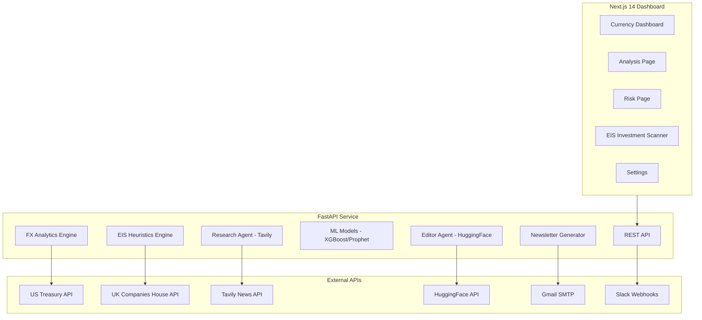

# Sapphire Intelligence Platform
## Comprehensive Project Report

---

## Executive Summary

The **Sapphire Intelligence Platform** is a dual-purpose enterprise analytics system built for **Sapphire Capital Partners**. It combines:

1. **Currency Intelligence** - FX monitoring, ML forecasting, and risk analytics for USD pairs
2. **EIS Investment Scanner** - UK Companies House integration for Enterprise Investment Scheme eligibility screening

**Project Status:** Production-ready with ongoing enhancements

---

## Platform Architecture



---

## Module 1: Currency Intelligence

### Features
| Feature | Description |
|---------|-------------|
| **Data Pipeline** | 5+ years of historical data from US Treasury |
| **Analytics** | MoM, QoQ, YoY changes, volatility, anomaly detection |
| **ML Forecasting** | XGBoost and Prophet models with 80% confidence intervals |
| **Risk Management** | VaR, CVaR, stress testing (2008 GFC, Brexit, COVID) |
| **Alerting** | Slack webhooks for significant market movements |

### Currencies Tracked
- USD/EUR
- USD/GBP
- USD/CAD

### Tech Stack
- **Frontend**: Next.js 14, TypeScript, Tailwind CSS, Recharts
- **Backend**: Python, FastAPI, Pandas, XGBoost, Prophet
- **Data**: US Treasury Fiscal Data API

---

## Module 2: EIS Investment Scanner

### Purpose
Screen UK companies for Enterprise Investment Scheme (EIS) eligibility using Companies House data and AI-powered news analysis.

### Features
| Feature | Description |
|---------|-------------|
| **Company Search** | Search UK companies by name or registration number |
| **EIS Scoring** | 0-100 heuristic scoring based on HMRC EIS criteria |
| **Risk Flags** | Automatic detection of dissolved companies, insolvency, excluded sectors |
| **AI Newsroom** | Tavily-powered news with HuggingFace AI summaries |
| **Portfolio Management** | Save and track companies for due diligence |
| **Newsletter** | Professional HTML email with portfolio updates and sector news |

### EIS Scoring Criteria (0-100)
| Factor | Points |
|--------|--------|
| Company Age (< 7 years) | +20 |
| Active Company Status | +15 |
| Qualifying SIC Codes | +20 |
| No Insolvency History | +15 |
| No Excluded Trades | +15 |
| R&D/Knowledge Intensive | +15 |

### External APIs
| API | Purpose |
|-----|---------|
| **Companies House** | Company profiles, filings, PSCs, charges |
| **Tavily** | Real-time news search |
| **HuggingFace** | Mistral 7B for news summarization |
| **Gmail SMTP** | Newsletter email delivery |

---

## Recent Work Completed

### Critical Bug Fixes (December 2024)
| Bug | Issue | Solution |
|-----|-------|----------|
| **Model Identity** | Frontend showed "TinyLlama 1.1B" instead of "Mistral 7B" | Updated frontend text |
| **Score Disconnect** | EIS scores not passing to Editor Agent | Fixed silent exception, added fallback |
| **Zombie Companies** | Dissolved companies getting positive scores | Added hard gate for dissolved/liquidated status |

### Newsletter Redesign
| Before | After |
|--------|-------|
| Basic text email | Professional HTML with 3 sections |
| No sector news | Tavily-powered sector intelligence |
| Flexbox layout (broken in email) | Table-based email-safe layout |

### Newsletter Sections
1. **Your EIS Portfolio** - Company cards with scores, status badges, sector tags
2. **UK EIS Sector Intelligence** - Technology, Healthcare, Fintech, Clean Energy news
3. **AI News Summaries** - Company-specific news from Tavily + HuggingFace

### Scoring System Update
| Before | After |
|--------|-------|
| Scores displayed as X/110 | Scores displayed as X/100 |
| 1.1 multiplier inflation | No artificial inflation |
| Non-standard percentage | Standard EIS percentage |

### Demo Data Removal
- Removed automatic loading of scan history as portfolio
- Portfolio now starts completely empty
- Users must manually add companies

---

## How to Run

### Quick Start (Windows)
```cmd
run.bat
```

### Manual Start
```bash
# Backend (in backend directory)
conda activate currency-intelligence
python -m uvicorn api.server:app --host 0.0.0.0 --port 8000 --reload

# Frontend (in frontend directory)
npm run dev
```

### URLs
| Service | URL |
|---------|-----|
| Dashboard | http://localhost:3000 |
| EIS Scanner | http://localhost:3000/eis |
| API Docs | http://localhost:8000/docs |

---

## Environment Variables

### Backend (`backend/.env`)
```env
# Companies House
COMPANIES_HOUSE_API_KEY=your_api_key

# Tavily (News Search)
TAVILY_API_KEY=your_api_key

# HuggingFace (AI Summarization)
HF_API_KEY=your_api_key

# Gmail (Newsletter)
GMAIL_ADDRESS=your_email@gmail.com
GMAIL_APP_PASSWORD=your_app_password

# Slack (Alerts)
SLACK_WEBHOOK_URL=your_webhook_url

# Supabase (Optional)
SUPABASE_URL=your_supabase_url
SUPABASE_KEY=your_supabase_key
```

---

## Project Structure

```
sapphire-intelligence-platform/
├── backend/
│   ├── api/                    # FastAPI endpoints
│   │   └── server.py           # Main API (3300+ lines)
│   ├── analytics/
│   │   └── eis_heuristics.py   # EIS scoring engine
│   ├── automation/
│   │   ├── mailer.py           # Newsletter HTML generator
│   │   ├── writer.py           # AI content writer
│   │   └── slack_sender.py     # Slack integration
│   ├── services/
│   │   ├── research_agent.py   # Tavily news search
│   │   └── editor_agent.py     # HuggingFace AI summarization
│   ├── ml/                     # XGBoost/Prophet models
│   └── trained_models/         # Saved ML models
├── frontend/
│   ├── src/app/
│   │   ├── page.tsx            # Currency Dashboard
│   │   ├── analysis/           # Analysis page
│   │   ├── risk/               # Risk analytics
│   │   ├── eis/                # EIS Investment Scanner
│   │   └── settings/           # Settings page
│   └── src/components/         # React components
├── run.bat                     # Windows startup script
├── README.md                   # Project documentation
└── PROJECT_REPORT.md           # This report
```

---

## Git Commits (Recent)

| Commit | Description |
|--------|-------------|
| `5ba799a` | Change EIS score from /110 to /100 scale |
| `e9bde75` | Remove demo companies from portfolio |
| `3cfec3c` | Fix email layout with table-based design |
| `b3c48a9` | Redesigned EIS Newsletter with 3 sections |
| `fbc1f19` | Fix critical integration bugs (Model Identity, Score Disconnect, Zombie Companies) |

---

## Future Roadmap

### Currency Intelligence
- Ensemble ML models (XGBoost + ARIMA + LSTM)
- Additional currency pairs (JPY, CHF, AUD, CNY)
- Portfolio hedging recommendations

### EIS Investment Scanner
- Supabase persistence for portfolios
- PDF report generation
- Scheduled newsletter automation
- Multi-user support with authentication

---

## Repository

**GitHub**: [nagasriramnani/Currency-Intelligence-Platform-V2](https://github.com/nagasriramnani/Currency-Intelligence-Platform-V2)

---

*Report Generated: December 25, 2024*  
*Platform Version: 2.1.0*
