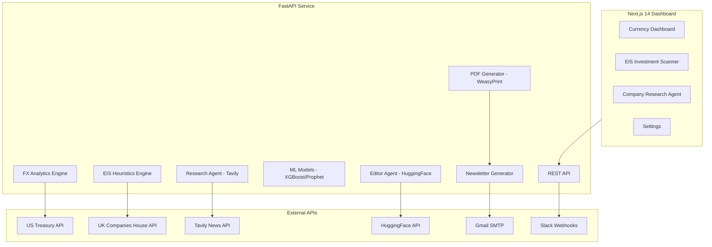

# Sapphire Intelligence Platform
## Comprehensive Project Report

---

## Executive Summary

The **Sapphire Intelligence Platform** is a dual-purpose enterprise analytics system built for **Sapphire Capital Partners**. It combines:

1. **Currency Intelligence** - FX monitoring, ML forecasting, and risk analytics for USD pairs
2. **EIS Investment Scanner** - UK Companies House integration for Enterprise Investment Scheme eligibility screening
3. **EIS Advisor** - AI-powered chat assistant (Ollama llama3.2) for EIS questions
4. **Company Research Agent** - Tavily-powered deep research with PDF export and email delivery

**Project Status:** Production-ready  
**Version:** 3.0.0  
**Latest Update:** January 5, 2026

---

## Key Highlights for Interview

### 🎯 What I Built

| Component | Tech Stack | Key Achievement |
|-----------|------------|-----------------|
| **Currency Dashboard** | Next.js 14 + Recharts | Real-time FX with ML forecasting |
| **EIS Scanner** | FastAPI + Companies House API | 6 mandatory gates, 0-100 scoring |
| **EIS Advisor** | Ollama (llama3.2) | AI chat for EIS questions |
| **Research Agent** | Tavily + WeasyPrint | Automated company research with PDF |
| **AI Newsletter** | Tavily + HuggingFace | Smart email with company intelligence |

### 🔧 Technical Skills Demonstrated

- **Full-Stack Development**: React/Next.js frontend + Python FastAPI backend
- **ML/AI Integration**: XGBoost forecasting, Prophet time series, HuggingFace LLM
- **API Integration**: 5+ external APIs (Treasury, Companies House, Tavily, HuggingFace, Gmail)
- **Data Engineering**: Pandas, time series analysis, risk calculations (VaR, CVaR)
- **DevOps**: Environment management, .env configuration, deployment scripts

---

## Platform Architecture



---

## Module 1: Currency Intelligence

### Features
| Feature | Description |
|---------|-------------|
| **Data Pipeline** | 5+ years of historical data from US Treasury |
| **Analytics** | MoM, QoQ, YoY changes, volatility, anomaly detection |
| **ML Forecasting** | XGBoost and Prophet models with 80% confidence intervals |
| **Risk Management** | VaR, CVaR, stress testing (2008 GFC, Brexit, COVID) |
| **Alerting** | Slack webhooks for significant market movements |

### Currencies Tracked
- USD/EUR, USD/GBP, USD/CAD

### Tech Stack
- **Frontend**: Next.js 14, TypeScript, Tailwind CSS, Recharts
- **Backend**: Python, FastAPI, Pandas, XGBoost, Prophet

---

## Module 2: EIS Investment Scanner

### Purpose
Screen UK companies for Enterprise Investment Scheme (EIS) eligibility using Companies House data and AI-powered news analysis.

### Features
| Feature | Description |
|---------|-------------|
| **Company Search** | Search UK companies by name or registration number |
| **EIS Scoring** | 0-100 heuristic scoring based on HMRC EIS criteria |
| **Smart Eligibility** | Automatic "Likely Not Eligible" when age score = 0 or score < 50 |
| **AI Newsroom** | Tavily-powered news with HuggingFace AI summaries |
| **Portfolio Management** | Save and track companies for due diligence |
| **Newsletter** | Professional HTML email with AI company intelligence |

### EIS Scoring Criteria (0-100)
| Factor | Points |
|--------|--------|
| Company Age (< 7 years) | +20 |
| Active Company Status | +15 |
| Qualifying SIC Codes | +20 |
| No Insolvency History | +15 |
| No Excluded Trades | +15 |
| R&D/Knowledge Intensive | +15 |

### Smart Eligibility Warning
```
When Company Age Score = 0/20 OR EIS Score < 50:
  Badge shows: "Likely Not Eligible" (RED)
  
Otherwise:
  Badge shows: "Likely Eligible" (GREEN)
```

---

## Module 3: Company Research Agent (NEW)

### Purpose
Deep-dive company research using Tavily AI search, with PDF export and email delivery.

### Features
| Feature | Description |
|---------|-------------|
| **Multi-Query Research** | 16 parallel Tavily queries across 4 categories |
| **Structured Report** | Company Overview, Industry, Financial, News sections |
| **PDF Generation** | Professional WeasyPrint PDF with styling |
| **Email Delivery** | Gmail SMTP with PDF attachment |
| **Example Companies** | Quick-fill demos (Spotify, Revolut, Stripe, Notion) |

### Research Categories
1. **Company Overview** - funding, valuation, team, headquarters
2. **Industry Overview** - market size, trends, competitive landscape
3. **Financial Overview** - revenue, growth, profitability
4. **Recent News** - latest announcements, press coverage

### API Endpoints
| Endpoint | Method | Purpose |
|----------|--------|---------|
| `/api/research/company` | POST | Trigger Tavily research |
| `/api/research/pdf` | POST | Generate PDF from report |
| `/api/research/email` | POST | Email report with PDF attachment |

---

## Module 4: AI Newsletter System

### Newsletter Structure
| Section | Content |
|---------|---------|
| **Portfolio Summary** | Companies reviewed, eligible, review required, ineligible |
| **Top Changes** | Top 3 companies with score, signals, recommendations |
| **🤖 AI Company Intelligence** | Tavily-researched news per company |
| **Watchlist** | Companies needing manual review |
| **Full Portfolio** | Compact table with all companies |
| **Data Sources** | Companies House, Tavily, HuggingFace |
| **Next Scheduled Run** | Based on frequency (weekly/monthly/yearly) |

### Frequency Support
| Frequency | Next Run |
|-----------|----------|
| Weekly | Monday 08:00 |
| Monthly | 1st of month 08:00 |
| Yearly | 1st Jan 08:00 |
| Now | On-demand (manual) |

---

## Recent Work Completed (December 2024)

### Major Features Delivered

| Feature | Description |
|---------|-------------|
| **Company Research Agent** | Full Tavily-powered research with PDF + email |
| **AI Company Intelligence** | Tavily news in newsletter per company |
| **Smart Eligibility Badge** | Auto-detects ineligible companies |
| **Newsletter Redesign** | Professional HTML with 7 sections |
| **Score Fix** | Changed from /110 to /100 scale |

### Bug Fixes

| Bug | Solution |
|-----|----------|
| Score showing /110 | Hardcoded maxScore to 100 |
| Zombie companies eligible | Hard gate for dissolved status |
| Age warning wrong logic | Now checks factor SCORE not years |
| Email gaps/layout issues | Table-based email-safe HTML |
| Demo data loading | Portfolio starts empty |

---

## How to Run

### Quick Start (Windows)
```cmd
run.bat
```

### Manual Start
```bash
# Backend
conda activate currency-intelligence
cd backend
python -m uvicorn api.server:app --host 0.0.0.0 --port 8000 --reload

# Frontend
cd frontend
npm run dev
```

### URLs
| Service | URL |
|---------|-----|
| Dashboard | http://localhost:3000 |
| EIS Scanner | http://localhost:3000/eis |
| Research Agent | http://localhost:3000/research |
| API Docs | http://localhost:8000/docs |

---

## Environment Variables

### Required (`backend/.env`)
```env
# Companies House
COMPANIES_HOUSE_API_KEY=your_api_key

# Tavily (News Search)
TAVILY_API_KEY=tvly-xxxxxxxxxxxx

# HuggingFace (AI Summarization)
HF_API_KEY=hf_xxxxxxxxxxxx

# Gmail (Newsletter)
GMAIL_ADDRESS=your_email@gmail.com
GMAIL_APP_PASSWORD=your_app_password

# Slack (Optional)
SLACK_WEBHOOK_URL=your_webhook_url
```

---

## Project Structure

```
sapphire-intelligence-platform/
├── backend/
│   ├── api/server.py                  # Main API (3500+ lines)
│   ├── analytics/eis_heuristics.py    # EIS scoring engine
│   ├── automation/
│   │   ├── mailer.py                  # Newsletter HTML generator
│   │   ├── pdf_generator.py           # WeasyPrint PDF generator
│   │   └── slack_sender.py            # Slack integration
│   ├── services/
│   │   ├── research_agent.py          # Tavily news search
│   │   ├── editor_agent.py            # HuggingFace summarization
│   │   └── company_researcher.py      # Deep research agent
│   └── ml/                            # XGBoost/Prophet models
├── frontend/
│   ├── src/app/
│   │   ├── page.tsx                   # Currency Dashboard
│   │   ├── eis/page.tsx               # EIS Investment Scanner
│   │   └── research/page.tsx          # Company Research Agent
│   └── src/components/                # React components
├── run.bat                            # Windows startup script
└── PROJECT_REPORT.md                  # This report
```

---

## Git Commits (Recent)

| Commit | Description |
|--------|-------------|
| `cc6d445` | Badge shows "Likely Not Eligible" when age score is 0 |
| `f312120` | Eligibility warning checks Company Age SCORE |
| `65d5a6f` | Score displays /100 and adds eligibility warning |
| `f28d497` | AI Company Intelligence section in newsletter |
| `9b0e70d` | Complete newsletter redesign with 7 sections |

---

## Skills Demonstrated

### Frontend
- React/Next.js 14 with TypeScript
- Tailwind CSS + Custom Components
- Framer Motion animations
- Recharts data visualization

### Backend
- FastAPI REST API design
- Python data engineering (Pandas)
- ML model integration (XGBoost, Prophet)
- LLM integration (HuggingFace)

### APIs & Integration
- External API orchestration
- Error handling and fallbacks
- Rate limiting awareness
- SMTP email delivery

### DevOps
- Git version control
- Environment configuration
- Cross-platform scripts

---

## Repository

**GitHub**: [nagasriramnani/Currency-Intelligence-Platform-V2](https://github.com/nagasriramnani/Currency-Intelligence-Platform-V2)

---

*Report Generated: December 26, 2024*  
*Platform Version: 2.2.0*
