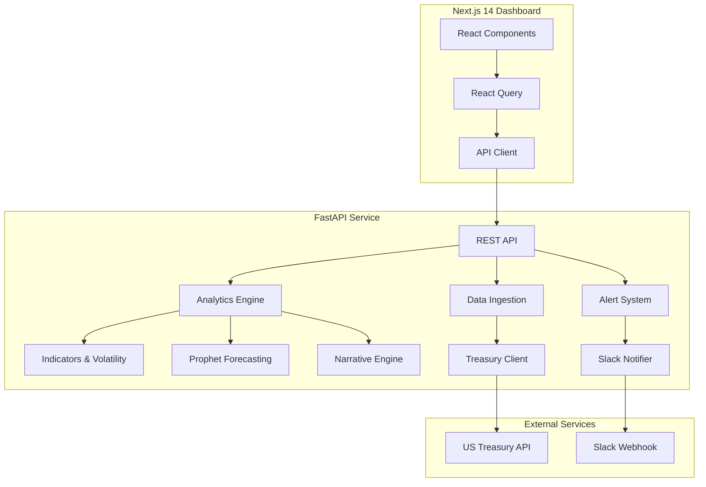

# Currency Intelligence Platform
## Project Report & Technical Walkthrough

---

## Executive Summary

The **Currency Intelligence Platform** is an enterprise-grade financial analytics system built for **Sapphire Capital Partners**. It provides real-time FX monitoring, ML-powered forecasting, and automated alerting for USD currency pairs against EUR, GBP, and CAD.

**Key Outcomes:**
- ✅ End-to-end analytics pipeline from data ingestion to dashboard visualization
- ✅ Machine Learning forecasting with Prophet time-series models
- ✅ Automated Slack alerting for critical market movements
- ✅ Premium Next.js dashboard with glassmorphism design
- ✅ 25 years of historical data coverage (2000-2025)

---

## Project Architecture



### Tech Stack

| Layer | Technologies |
|-------|-------------|
| **Frontend** | Next.js 14, TypeScript, Tailwind CSS, Recharts, Lucide React |
| **Backend** | Python 3.9, FastAPI, Pandas, NumPy, Prophet, scikit-learn |
| **ML/AI** | Prophet 1.2.1, PyTorch 2.8.0, statsmodels |
| **Data Source** | U.S. Treasury Fiscal Data API |
| **Alerting** | Slack Webhooks |

---

## What We Built

### 1. Data Pipeline
- **Source**: Official U.S. Treasury exchange rate data
- **Coverage**: 25 years of historical data (2000-2025)
- **Processing**: Automatic indicator calculation (MoM, QoQ, YoY changes)
- **Quality**: Full pagination, retry logic, and error handling

### 2. Analytics Engine
| Feature | Description |
|---------|-------------|
| **Indicators** | Month-over-month, quarter-over-quarter, year-over-year changes |
| **Volatility** | Rolling volatility, annualized risk, regime classification (High/Normal/Low) |
| **Anomaly Detection** | Z-score and Isolation Forest methods |
| **Direction Classification** | Rising/Falling/Flat trend identification |

### 3. ML Forecasting
- **Model**: Facebook Prophet for time-series forecasting
- **Confidence**: 80% prediction intervals
- **Horizon**: Up to 12 months forward projection
- **Auto-training**: Models retrain on data refresh

### 4. Premium Dashboard
Five core visualizations:
1. **Multi-Currency Trend** – Historical overview with moving averages
2. **YoY Comparison** – Structural strengthening/weakening analysis
3. **Volatility Chart** – Risk regime identification
4. **Forecast vs Actual** – ML predictions with confidence bands
5. **Return Distribution** – Comparative risk/return profiles

### 5. Alerting System
- **Slack Integration**: Automated webhooks for significant events
- **Triggers**: YoY movements > 5%, volatility spikes, anomalies
- **Audit Trail**: Full history of generated alerts

---

## What We Achieved in This Session

| Task | Status | Description |
|------|--------|-------------|
| Repository Setup | ✅ | Cloned and configured the project locally |
| Deployment Guide | ✅ | Created comprehensive local run and Vercel deployment documentation |
| Slack Integration Fix | ✅ | Configured `.env` with webhook credentials, verified connectivity |
| Run Script Update | ✅ | Fixed `run.bat` with proper conda initialization and `--reload` flag |
| GitHub Sync | ✅ | Pushed all changes to remote repository |

### Files Modified/Created
- `backend/.env` – Slack webhook and FMP API configuration
- `backend/debug_slack.py` – Diagnostic utility for Slack testing
- `run.bat` – Improved startup script with conda initialization

---

## Business Value

### For Financial Analysts
- **Time Savings**: Automated data collection and processing
- **Deep Insights**: 25 years of historical context for decision-making
- **Early Warnings**: Proactive alerts for market movements

### For Portfolio Managers
- **Risk Quantification**: Volatility metrics and regime classification
- **Forecasting**: ML-powered projections for planning
- **Board-Ready**: Professional visualizations for stakeholder presentations

### For IT/Operations
- **Single Command Start**: `run.bat` launches entire platform
- **Environment Isolation**: Conda environment prevents dependency conflicts
- **Extensible**: Modular architecture for adding new currencies/features

---

## How to Run

### Local Development
```bash
# One-command startup (Windows)
run.bat

# Manual startup
cd backend && conda activate currency-intelligence && python -m uvicorn api.server:app --reload
cd frontend && npm run dev
```

### URLs
| Service | URL |
|---------|-----|
| Dashboard | http://localhost:3000 |
| API | http://localhost:8000 |
| API Docs | http://localhost:8000/docs |

---

## Future Roadmap

- **Portfolio Analytics**: Multi-currency tracking and hedging recommendations
- **Advanced Forecasting**: Ensemble models (Prophet + ARIMA + LSTM)
- **Expanded Coverage**: Add JPY, CHF, AUD, CNY
- **User Management**: Role-based access control

---

## Repository

**GitHub**: [nagasriramnani/Currency-Intelligence-Platform](https://github.com/nagasriramnani/Currency-Intelligence-Platform)

---

*Report generated: December 14, 2024*
