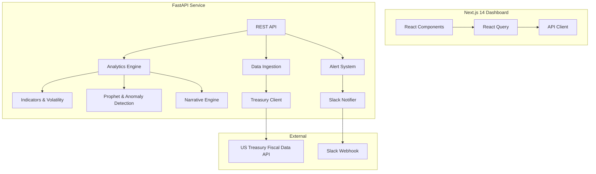

# Currency Intelligence Platform

**A Board-Ready FX Analytics and Forecasting System for Sapphire Capital Partners**


---

## 📋 Table of Contents

- [Overview](#-overview)
- [Key Features](#-key-features)
- [Architecture](#-architecture)
- [Data Source](#-data-source)
- [Installation & Setup](#-installation--setup)
- [Running the Application](#-running-the-application)
- [Testing](#-testing)
- [Presentation Guide](#-presentation-guide)
- [Recent Updates](#-recent-updates)
- [Troubleshooting](#-troubleshooting)
- [Future Roadmap](#-future-roadmap)

---

## 🎯 Overview

The **Currency Intelligence Platform** is an enterprise-grade financial analytics system designed for Sapphire Capital Partners. It ingests official U.S. Treasury FX reference data, enriches it with analytics and machine learning, and presents it in a premium Next.js dashboard.

**Currencies tracked**: USD vs EUR, GBP, CAD
**Historical Coverage**: 5 Years (2000-Present)

### Problem Statement
Sapphire Capital Partners requires a comprehensive system to:
1. **Monitor USD strength** against major trading partners.
2. **Identify trends** and turning points.
3. **Quantify risk** through volatility analysis.
4. **Forecast future movements** using Machine Learning.
5. **Alert stakeholders** of critical market shifts.

---

## ✨ Key Features

### 📊 Data & Analytics
- **Official Data**: Real-time ingestion from U.S. Treasury Fiscal Data API.
- **Deep History**: 5 years of data (2000-2025) for robust long-term analysis.
- **Indicators**: MoM, QoQ, YoY changes, and direction classification (Rising/Falling/Flat).
- **Volatility**: Rolling volatility, annualized risk, and regime classification (High/Normal/Low).

### 🤖 Machine Learning & Intelligence
- **Forecasting**: Prophet-based time series forecasting with 80% confidence intervals.
- **Anomaly Detection**: Z-score and Isolation Forest methods to spot unusual movements.
- **Narrative Engine**: AI-generated natural language insights for non-technical stakeholders.

### 🎨 Premium Dashboard
- **Sapphire Branding**: Deep blue aesthetic with glassmorphism and smooth animations.
- **5 Core Visualizations**:
    1. **Multi-Currency Trend**: Historical overview with moving averages.
    2. **YoY Comparison**: Structural strengthening/weakening analysis.
    3. **Volatility Chart**: Risk regime identification.
    4. **Forecast vs Actual**: ML predictions with confidence bands.
    5. **Return Distribution**: Comparative risk/return profiles.
- **Interactive Tools**: Date range selectors (1Y/3Y/5Y/Max), presentation mode, and CSV export.

### 🔔 Alerting
- **Slack Integration**: Automated webhooks for significant events (YoY > 5%, Volatility spikes).
- **History**: Full audit trail of generated alerts.

---

## 🏗️ Architecture



### Tech Stack
- **Frontend**: Next.js 14 (App Router), TypeScript, Tailwind CSS, Recharts, Lucide React.
- **Backend**: Python 3.9+, FastAPI, Pandas, NumPy, Prophet, Scikit-learn.
- **Data**: U.S. Treasury Fiscal Data API.

---

## 📡 Data Source

**Official Source**: [U.S. Treasury Reporting Rates of Exchange](https://fiscaldata.treasury.gov/datasets/treasury-reporting-rates-exchange/treasury-reporting-rates-of-exchange)

- **Update Frequency**: Quarterly.
- **Volume**: ~300 raw records enriched to ~900 analytical points per currency.
- **Quality**: Full pagination, retry logic, and error handling.

---

## 🚀 Installation & Setup

### Prerequisites
- **Python 3.9+** (via Anaconda/Miniconda recommended)
- **Node.js 18+**

### Automated Setup (Recommended)

**Windows**:
```cmd
run.bat
```

**Mac/Linux**:
```bash
chmod +x run.sh
./run.sh
```

This script will:
1. Create a Python virtual environment (Conda).
2. Install all backend dependencies.
3. Install frontend dependencies.
4. Start both the API and Dashboard.

### Manual Setup

**1. Backend**:
```bash
cd backend
conda env create -f environment.yml
conda activate currency-intelligence
# OR using venv
# python -m venv venv
# source venv/bin/activate
pip install -r requirements.txt
```

**2. Frontend**:
```bash
cd frontend
npm install
```

---

## ▶️ Running the Application

### Start Backend
```bash
cd backend
# Ensure environment is activated
python -m uvicorn api.server:app --host 0.0.0.0 --port 8000 --reload
```
*API available at: http://localhost:8000*  
*Docs available at: http://localhost:8000/docs*

### Start Frontend
```bash
cd frontend
npm run dev
```
*Dashboard available at: http://localhost:3000*

---

## 🧪 Testing

**Backend Tests**:
```bash
cd backend
pytest
```
Covers indicators, volatility, anomalies, and alerting logic.

**Frontend Linting**:
```bash
cd frontend
npm run lint
```

---

## 🎥 Presentation Guide

**Recommended Flow (4-6 Minutes)**:

1.  **Landing (30s)**: Show KPI cards and "Market Pulse".
2.  **Trends (60s)**: Navigate to "Historical Trends", toggle moving average.
3.  **YoY (45s)**: Scroll to "Year-on-Year Comparison".
4.  **Risk (45s)**: Show "Volatility Risk" chart.
5.  **Forecast (60s)**: Switch to "Forecast" tab, explain confidence bands.
6.  **Intelligence (45s)**: Highlight AI insights and Alerts panel.
7.  **Closing (15s)**: Enable **Presentation Mode** for a clean board view.

---

## 🔄 Recent Updates

- **Maximum History**: Expanded data coverage from 4 years to **5 years** (2000-2025).
- **New Pages**: Added dedicated **Analysis** and **Settings** pages.
- **Visual Upgrade**: Implemented "Sapphire" premium theme with glassmorphism.
- **Documentation**: Consolidated scattered docs into this single master file.

---

## 🔧 Troubleshooting

**Prophet Errors**:
If you encounter issues with the forecasting model, run:
```cmd
cd backend
fix_prophet_quick.bat
```

**Slow First Load**:
Loading 5 years of data and training ML models takes **60-90 seconds** on the first run. Subsequent loads are cached and take 5-10 seconds.

**Slack Alerts**:
To enable alerts, copy `backend/slack_config.env` to `backend/.env` and add your webhook URL.

---

## 🔮 Future Roadmap

- **Portfolio Analytics**: Multi-currency portfolio tracking and hedging recommendations.
- **Advanced Forecasting**: Ensemble models (Prophet + ARIMA + LSTM).
- **Expanded Coverage**: Add JPY, CHF, AUD, CNY.
- **User Management**: Role-based access control and personalized dashboards.

---

**Built for Sapphire Capital Partners** | Version 1.0.0 | November 2024
