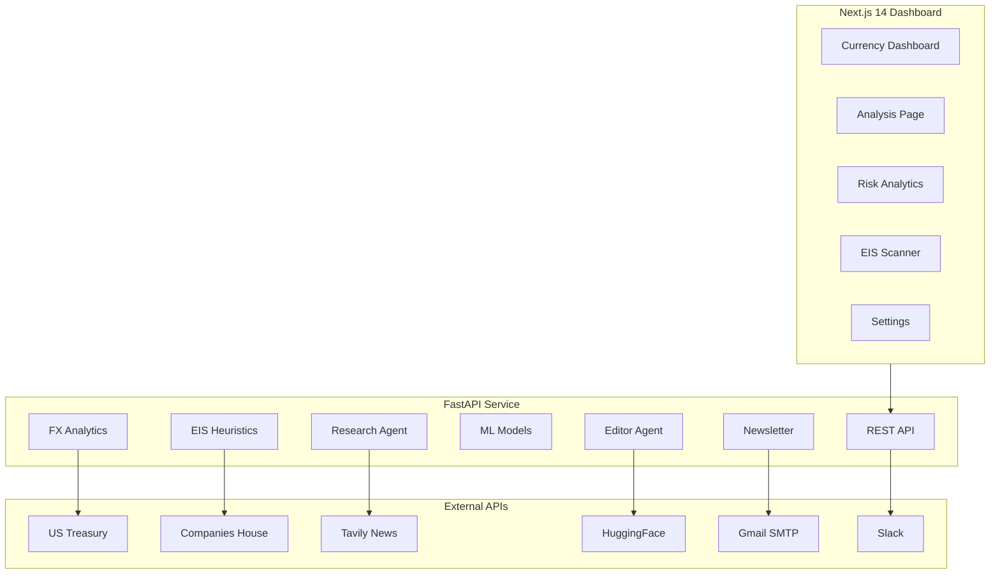

# Sapphire Intelligence Platform

**An Enterprise-Grade Financial Analytics & Investment Screening System**


---

## 🎯 Overview

The **Sapphire Intelligence Platform** is a comprehensive financial analytics system combining:

1. **Currency Intelligence** – FX monitoring, ML forecasting, and risk analytics for USD pairs
2. **EIS Investment Scanner** – UK company screening for Enterprise Investment Scheme eligibility

Built for **Sapphire Capital Partners** with a premium Next.js dashboard and Python/FastAPI backend.

---

## ✨ Key Features

### 📊 Currency Intelligence
| Feature | Description |
|---------|-------------|
| **Official Data** | US Treasury FX rates with 5+ years history |
| **Analytics** | MoM, QoQ, YoY changes, volatility metrics |
| **ML Forecasting** | XGBoost & Prophet with 80% confidence intervals |
| **Risk Management** | VaR, CVaR, stress testing (2008 GFC, Brexit, COVID) |
| **Alerting** | Slack webhooks for significant market movements |

### 🏢 EIS Investment Scanner
| Feature | Description |
|---------|-------------|
| **Company Search** | UK Companies House integration |
| **EIS Scoring** | 0-100 heuristic scoring based on HMRC criteria |
| **Risk Flags** | Dissolved, insolvency, excluded sector detection |
| **AI Newsroom** | Tavily news + HuggingFace (Mistral 7B) summaries |
| **Portfolio** | Track companies for due diligence |
| **Newsletter** | Professional HTML email with sector intelligence |

### 🎨 Premium Dashboard
- **Glassmorphism Design** – Modern transparent panels with blur effects
- **Dynamic Themes** – Sapphire, Emerald, Violet, Rose accent colors
- **Micro-Animations** – Count-up KPIs, staggered fade-ins, hover effects
- **Responsive** – Mobile-friendly layouts

---

## 🏗️ Architecture



---

## 🚀 Quick Start

### Windows
```cmd
run.bat
```

### Manual Start
```bash
# Backend
cd backend
conda activate currency-intelligence
python -m uvicorn api.server:app --host 0.0.0.0 --port 8000 --reload

# Frontend
cd frontend
npm run dev
```

### URLs
| Service | URL |
|---------|-----|
| Dashboard | http://localhost:3000 |
| EIS Scanner | http://localhost:3000/eis |
| API Docs | http://localhost:8000/docs |

---

## ⚙️ Environment Variables

Create `backend/.env`:

```env
# Companies House (EIS Scanner)
COMPANIES_HOUSE_API_KEY=your_api_key

# Tavily (AI Newsroom)
TAVILY_API_KEY=your_api_key

# HuggingFace (AI Summarization)
HF_API_KEY=your_api_key

# Gmail (Newsletter)
GMAIL_ADDRESS=your_email@gmail.com
GMAIL_APP_PASSWORD=your_app_password

# Slack (Alerts)
SLACK_WEBHOOK_URL=your_webhook_url

# Financial Modeling Prep (Optional)
FMP_API_KEY=your_api_key

# Supabase (Optional)
SUPABASE_URL=your_url
SUPABASE_KEY=your_key
```

---

## 📁 Project Structure

```
sapphire-intelligence-platform/
├── backend/
│   ├── api/server.py           # Main FastAPI (3300+ lines)
│   ├── analytics/
│   │   └── eis_heuristics.py   # EIS scoring engine
│   ├── automation/
│   │   ├── mailer.py           # Newsletter HTML generator
│   │   └── slack_sender.py     # Slack integration
│   ├── services/
│   │   ├── research_agent.py   # Tavily news search
│   │   └── editor_agent.py     # HuggingFace AI
│   ├── ml/                     # XGBoost/Prophet
│   └── trained_models/         # Saved models
├── frontend/
│   ├── src/app/
│   │   ├── page.tsx            # Currency Dashboard
│   │   ├── eis/                # EIS Investment Scanner
│   │   ├── analysis/           # Analysis page
│   │   ├── risk/               # Risk analytics
│   │   └── settings/           # Settings
│   └── src/components/         # React components
├── run.bat                     # Windows startup
├── README.md                   # This file
└── PROJECT_REPORT.md           # Detailed report
```

---

## 📄 Pages

### Currency Dashboard (/)
- Market Pulse KPIs with live rates
- Historical trends with moving averages
- Volatility risk visualization
- XGBoost forecast with confidence bands

### Analysis (/analysis)
- Correlation matrix
- Seasonality analysis
- Scenario builder

### Risk (/risk)
- VaR analysis (Parametric & Historical)
- Stress test scenarios
- AI hedging recommendations

### EIS Scanner (/eis)
- Company search by name/number
- EIS eligibility scoring (0-100)
- Risk flag detection
- AI Newsroom with live news
- Portfolio management
- Newsletter subscription

### Settings (/settings)
- Theme customization
- API key management
- Notification preferences

---

## 🧪 Testing

```bash
# Backend tests
cd backend
pytest

# Frontend linting
cd frontend
npm run lint
```

---

## 📰 EIS Newsletter

The EIS newsletter includes three sections:

| Section | Content |
|---------|---------|
| **Your EIS Portfolio** | Company cards with score badges, status, sector |
| **UK Sector Intelligence** | Technology, Healthcare, Fintech, Clean Energy news |
| **AI News Summaries** | Company-specific AI-generated news |

### Trigger Newsletter
1. Go to EIS Scanner (/eis)
2. Add companies to portfolio
3. Click **Subscribe** → Select **Now**
4. Check email for newsletter

---

## 🔄 Recent Updates (v2.1.0)

### Bug Fixes
- ✅ Fixed Model Identity (shows "Mistral 7B" correctly)
- ✅ Fixed EIS Score disconnect (scores now pass to AI)
- ✅ Fixed Zombie Companies (dissolved companies blocked)

### Enhancements
- ✅ Newsletter redesign with 3 sections
- ✅ Table-based email layout (works in all clients)
- ✅ Score system changed from /110 to /100
- ✅ Removed demo portfolio data (starts empty)

---

## 🔧 Troubleshooting

### Slow First Load
Loading 5 years of data and training ML models takes **60-90 seconds** on first run. Subsequent loads are cached.

### Prophet Errors
```cmd
cd backend
fix_prophet_quick.bat
```

### Slack Alerts Not Working
Verify `SLACK_WEBHOOK_URL` in `backend/.env`

### Newsletter Not Sending
1. Check `GMAIL_ADDRESS` and `GMAIL_APP_PASSWORD`
2. Ensure "Less secure app access" or App Password is configured
3. Check backend logs for SMTP errors

---

## 🔮 Roadmap

### Currency Intelligence
- Ensemble ML models
- Additional currencies (JPY, CHF, AUD)
- Portfolio hedging

### EIS Scanner
- Supabase persistence
- PDF report generation
- Scheduled newsletters
- Multi-user authentication

---

## 📊 Tech Stack

| Layer | Technologies |
|-------|-------------|
| **Frontend** | Next.js 14, TypeScript, Tailwind CSS, Recharts |
| **Backend** | Python 3.9+, FastAPI, Pandas, XGBoost, Prophet |
| **AI/ML** | Mistral 7B (via HuggingFace), Tavily Search |
| **Data** | US Treasury, UK Companies House |
| **Email** | Gmail SMTP |
| **Alerts** | Slack Webhooks |

---

## 📝 License

MIT License - See LICENSE file

---

## 🔗 Repository

**GitHub**: [nagasriramnani/Currency-Intelligence-Platform-V2](https://github.com/nagasriramnani/Currency-Intelligence-Platform-V2)

---

**Built for Sapphire Capital Partners** | Version 2.1.0 | December 2025
