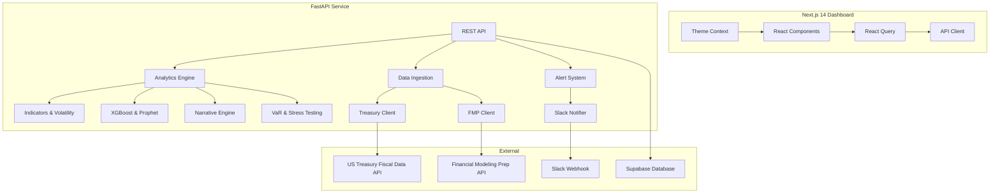

# Currency Intelligence Platform

**A Board-Ready FX Analytics and Forecasting System for Sapphire Capital Partners**


---

## 📋 Table of Contents

- [Overview](#-overview)
- [Key Features](#-key-features)
- [Architecture](#-architecture)
- [Pages & Components](#-pages--components)
- [Data Sources](#-data-sources)
- [Installation & Setup](#-installation--setup)
- [Running the Application](#-running-the-application)
- [Testing](#-testing)
- [Documentation](#-documentation)
- [Recent Updates](#-recent-updates)
- [Troubleshooting](#-troubleshooting)
- [Future Roadmap](#-future-roadmap)

---

## 🎯 Overview

The **Currency Intelligence Platform** is an enterprise-grade financial analytics system designed for Sapphire Capital Partners. It ingests official U.S. Treasury FX reference data, enriches it with analytics and machine learning, and presents it in a premium Next.js dashboard.

**Currencies tracked**: USD vs EUR, GBP, CAD
**Historical Coverage**: 5 Years (2020-Present)

### Problem Statement
Sapphire Capital Partners requires a comprehensive system to:
1. **Monitor USD strength** against major trading partners.
2. **Identify trends** and turning points.
3. **Quantify risk** through volatility and VaR analysis.
4. **Forecast future movements** using Machine Learning (XGBoost).
5. **Alert stakeholders** of critical market shifts via Slack.
6. **Simulate scenarios** for portfolio impact analysis.

---

## ✨ Key Features

### 📊 Data & Analytics
- **Official Data**: Real-time ingestion from U.S. Treasury Fiscal Data API + Financial Modeling Prep.
- **Deep History**: 5 years of data for robust long-term analysis.
- **Indicators**: MoM, QoQ, YoY changes, and direction classification (Rising/Falling/Flat).
- **Volatility**: Rolling volatility, annualized risk, and regime classification (High/Normal/Low).
- **Correlation Matrix**: Cross-currency correlation analysis for hedging optimization.
- **Seasonality Analysis**: 5-year monthly performance patterns.

### 🤖 Machine Learning & Intelligence
- **XGBoost Forecasting**: Time series forecasting with 80% confidence intervals.
- **Prophet Integration**: Alternative forecasting model option.
- **Anomaly Detection**: Z-score and Isolation Forest methods to spot unusual movements.
- **Narrative Engine**: AI-generated natural language insights for non-technical stakeholders.
- **Hedging Recommendations**: AI-powered hedging suggestions based on risk levels.

### 📈 Risk Management
- **Value at Risk (VaR)**: Parametric and Historical VaR at 90%, 95%, 99% confidence.
- **CVaR (Expected Shortfall)**: Tail risk measurement.
- **Stress Testing**: Historical crisis scenarios (2008 GFC, Brexit, COVID, Energy Crisis, Fed Rate Shock).
- **Real-time Risk Monitoring**: Automatic alerts when thresholds are breached.

### 🎨 Premium Dashboard
- **Dynamic Theme System**: Customizable accent colors (Sapphire, Emerald, Violet, Rose).
- **Micro-Animations**: Count-up animations, staggered fade-ins, hover effects, shimmer effects.
- **Camping Loader**: Beautiful loading animation during data fetches.
- **Glassmorphism**: Modern transparent panel design with blur effects.
- **5 Core Visualizations**:
    1. **Multi-Currency Trend**: Historical overview with moving averages.
    2. **YoY Comparison**: Structural strengthening/weakening analysis.
    3. **Volatility Chart**: Risk regime identification.
    4. **Forecast vs Actual**: ML predictions with confidence bands.
    5. **Return Distribution**: Comparative risk/return profiles.
- **Interactive Tools**: Date range selectors (1Y/3Y/5Y/Max), presentation mode, and CSV export.

### 🔔 Alerting & Integrations
- **Slack Integration**: Automated webhooks for significant events.
- **Supabase Database**: Cloud persistence for user data and settings.
- **Alert Types**: VaR breach, volatility spike, regime change notifications.
- **History**: Full audit trail of generated alerts.

---

## 🏗️ Architecture



### Tech Stack
- **Frontend**: Next.js 14 (App Router), TypeScript, Tailwind CSS, Recharts, Lucide React.
- **Backend**: Python 3.9+, FastAPI, Pandas, NumPy, XGBoost, Prophet, Scikit-learn.
- **Data**: U.S. Treasury Fiscal Data API, Financial Modeling Prep API.
- **Database**: Supabase (PostgreSQL).
- **Integrations**: Slack Webhooks.

---

## 📄 Pages & Components

### Dashboard (/)
| Component | Description |
|-----------|-------------|
| **Market Pulse KPIs** | 3 currency cards with live rates, YoY change, count-up animations |
| **Historical Trends** | Multi-line chart with moving averages |
| **Volatility Risk** | Rolling volatility visualization |
| **Year-on-Year Comparison** | Bar chart comparing current vs prior year rates |
| **AI Forecast Panel** | XGBoost predictions with confidence bands |
| **System Alerts** | Real-time VaR and volatility alerts |

### Analysis (/analysis)
| Component | Description |
|-----------|-------------|
| **Correlation Matrix** | 90-day rolling cross-currency correlations |
| **Seasonality Analysis** | 5-year monthly performance patterns |
| **Scenario Builder** | Portfolio impact simulation tool |

### Risk (/risk)
| Component | Description |
|-----------|-------------|
| **VaR Analysis** | Parametric & Historical VaR for each currency |
| **Stress Test Scenarios** | Crisis simulation (2008 GFC, Brexit, COVID, etc.) |
| **Hedging Recommendations** | AI-powered hedging suggestions with coverage % |
| **Cross-Currency Opportunities** | Correlation-based hedging efficiency |

### Settings (/settings)
| Section | Description |
|---------|-------------|
| **General** | Default currency, timezone, language |
| **Appearance** | Theme accent color selector (4 themes) |
| **Notifications** | Alert preferences, Slack integration |
| **API Keys** | FMP, Slack, Supabase key management |
| **Data Sources** | Connection status for data providers |
| **Security** | 2FA, session timeout, activity log |

---

## 📡 Data Sources

### U.S. Treasury Fiscal Data API
- **URL**: [fiscaldata.treasury.gov](https://fiscaldata.treasury.gov/datasets/treasury-reporting-rates-exchange/treasury-reporting-rates-of-exchange)
- **Update Frequency**: Quarterly
- **Usage**: Official exchange rate data

### Financial Modeling Prep API
- **API Key**: Configured in `.env`
- **Tier**: Free (250 requests/day)
- **Usage**: Real-time rate updates, historical data supplements

### Supabase
- **URL**: `eepxywpskwjijxbroeoi.supabase.co`
- **Usage**: User sessions, settings persistence, alert history

---

## 🚀 Installation & Setup

### Prerequisites
- **Python 3.9+** (via Anaconda/Miniconda recommended)
- **Node.js 18+**

### Environment Variables

**Backend (`backend/.env`)**:
```env
FMP_API_KEY=your_fmp_api_key
SLACK_WEBHOOK_URL=https://hooks.slack.com/services/...
SUPABASE_URL=https://your-project.supabase.co
SUPABASE_KEY=your_supabase_anon_key
```

### Automated Setup (Recommended)

**Windows**:
```cmd
run.bat
```

**Mac/Linux**:
```bash
chmod +x run.sh
./run.sh
```

This script will:
1. Create a Python virtual environment (Conda).
2. Install all backend dependencies.
3. Install frontend dependencies.
4. Start both the API and Dashboard.

### Manual Setup

**1. Backend**:
```bash
cd backend
conda env create -f environment.yml
conda activate currency-intelligence
pip install -r requirements.txt
```

**2. Frontend**:
```bash
cd frontend
npm install
```

---

## ▶️ Running the Application

### Start Backend
```bash
cd backend
python -m uvicorn api.server:app --host 0.0.0.0 --port 8000 --reload
```
*API available at: http://localhost:8000*  
*Docs available at: http://localhost:8000/docs*

### Start Frontend
```bash
cd frontend
npm run dev
```
*Dashboard available at: http://localhost:3000*

---

## 🧪 Testing

**Backend Tests**:
```bash
cd backend
pytest
```
Covers indicators, volatility, anomalies, VaR calculations, and alerting logic.

**Frontend Linting**:
```bash
cd frontend
npm run lint
```

---

## 📚 Documentation

Comprehensive walkthrough guides are available in the `docs/walkthroughs/` folder:

| Document | Description |
|----------|-------------|
| [Dashboard Walkthrough](docs/walkthroughs/DASHBOARD_WALKTHROUGH.md) | Complete guide to dashboard KPI cards, charts, forecasting |
| [Risk Page Walkthrough](docs/walkthroughs/RISK_PAGE_WALKTHROUGH.md) | VaR analysis, stress testing, hedging recommendations |
| [Settings Page Walkthrough](docs/walkthroughs/SETTINGS_PAGE_WALKTHROUGH.md) | Configuration options, API keys, integrations |

---

## 🔄 Recent Updates (v2.0.0)

### New Pages
- ✅ **Risk Analytics Page**: Complete VaR analysis, stress testing, hedging recommendations
- ✅ **Settings Page**: Bloomberg/Stripe-style sidebar navigation with 6 configuration sections

### UI/UX Enhancements
- ✅ **Dynamic Theme System**: 4 accent colors (Sapphire, Emerald, Violet, Rose) that apply across all pages
- ✅ **Micro-Animations**: Count-up animations on KPI cards, staggered fade-ins, hover effects
- ✅ **Camping Loader**: Beautiful loading animation during page transitions
- ✅ **Glass Panels**: Enhanced glassmorphism with accent-colored borders
- ✅ **Responsive Design**: Mobile-friendly layouts

### Risk Management Features
- ✅ **VaR Analysis**: Parametric and Historical VaR at configurable confidence levels
- ✅ **CVaR (Expected Shortfall)**: Tail risk measurement
- ✅ **Stress Test Scenarios**: 5 historical crisis simulations
- ✅ **AI Hedging Recommendations**: Automated hedging suggestions with coverage percentages
- ✅ **Cross-Currency Correlations**: Efficient hedging through correlation analysis

### Integrations
- ✅ **Slack Webhooks**: Real-time alerts to Slack channels
- ✅ **Supabase Database**: Cloud persistence for settings and data
- ✅ **Financial Modeling Prep**: Additional data source for real-time rates

### Documentation
- ✅ **Dashboard Walkthrough**: Complete guide for technical and non-technical users
- ✅ **Risk Page Walkthrough**: VaR, stress testing, hedging explained
- ✅ **Settings Page Walkthrough**: Configuration and API key documentation

---

## 🔧 Troubleshooting

**Prophet Errors**:
If you encounter issues with the forecasting model, run:
```cmd
cd backend
fix_prophet_quick.bat
```

**Slow First Load**:
Loading 5 years of data and training ML models takes **60-90 seconds** on the first run. Subsequent loads are cached and take 5-10 seconds.

**Slack Alerts**:
Configure your webhook URL in `backend/.env`:
```env
SLACK_WEBHOOK_URL=https://hooks.slack.com/services/YOUR/WEBHOOK/URL
```

**Theme Not Applying**:
Refresh browser and clear cache. Theme settings are stored in localStorage.

---

## 🔮 Future Roadmap

- **Portfolio Analytics**: Multi-currency portfolio tracking and hedging recommendations.
- **Advanced Forecasting**: Ensemble models (XGBoost + ARIMA + LSTM).
- **Expanded Coverage**: Add JPY, CHF, AUD, CNY.
- **User Management**: Role-based access control and personalized dashboards.
- **Email Reports**: Scheduled PDF report delivery.
- **Mobile App**: React Native companion app.

---

## 📁 Project Structure

```
currency-intelligence-platform/
├── backend/
│   ├── api/              # FastAPI endpoints
│   ├── analytics/        # Indicators, volatility, VaR calculations
│   ├── alerts/           # Slack integration, alert logic
│   ├── ml/               # XGBoost, Prophet models
│   ├── data/             # Data ingestion clients
│   ├── insights/         # Narrative generation
│   ├── tests/            # Pytest test suite
│   └── trained_models/   # Saved ML models
├── frontend/
│   ├── src/
│   │   ├── app/          # Next.js pages (dashboard, analysis, risk, settings)
│   │   ├── components/   # React components
│   │   ├── lib/          # Utilities, API client, theme context
│   │   └── styles/       # CSS files
│   └── public/           # Static assets
├── docs/
│   └── walkthroughs/     # User documentation
├── README.md
├── run.bat / run.sh      # Startup scripts
└── LICENSE
```

---

**Built for Sapphire Capital Partners** | Version 2.0.0 | December 2025
